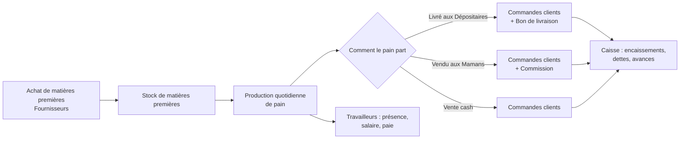

# Volume 1 — Présentation du produit et du problème résolu

## 1.1 Pourquoi ce logiciel existe

Boulangerie Lomoto est une boulangerie de République Démocratique du Congo. Comme beaucoup de petites entreprises, avant ce logiciel, sa gestion quotidienne reposait sur des supports papier : une fiche pour noter les commandes du soir, un carnet pour le registre de caisse, des feuilles volantes pour le suivi des employés. Ce mode de fonctionnement a trois limites structurelles, indépendamment de la rigueur des personnes qui le pratiquent :

1. **L'information reste bloquée là où elle est écrite.** Le Directeur Général ne sait ce qui se passe en caisse ou en production que si quelqu'un le lui rapporte, avec un décalage de temps qui empêche toute réaction rapide.
2. **Les calculs répétitifs sont une source d'erreur humaine.** Calculer une dette client en tenant compte d'une avance existante, ou une commission par bac livré, est simple une fois — mais devient risqué répété des dizaines de fois par jour, à la main.
3. **La mémoire de l'entreprise est fragile.** Un carnet perdu, une fiche mal rangée, c'est une partie de l'historique de l'entreprise qui disparaît — sans trace de qui a fait quoi, ni possibilité de revenir en arrière.

L'application « Boulangerie Lomoto » (nom de travail : *Lomoto*) a été conçue pour répondre exactement à ces trois limites : centraliser l'information, automatiser les calculs sensibles, et garder une trace fiable de toute action importante — tout en restant utilisable par une petite équipe de 2 à 5 personnes, sur des connexions internet parfois instables, en français comme dans les langues locales (lingala, swahili) ou en anglais.

> **Ce que dit la spécification du projet (`docs/spec-boulangerie.md`, section 1 — Vision)** : *« Une application web (responsive mobile) qui centralise toute la gestion quotidienne d'une boulangerie : vente en caisse, stocks de matières premières, production, commandes clients, fournisseurs et pilotage de l'activité. Utilisée par une petite équipe de 2 à 5 personnes organisée selon une hiérarchie de rôles, avec remontée d'information en temps réel vers les supérieurs hiérarchiques. »*

Ce livre reprend cette vision comme point de départ et vérifie, chapitre après chapitre, que le code du dépôt la met réellement en œuvre.

## 1.2 Le circuit métier d'une boulangerie, en bref

Pour comprendre l'application, il faut d'abord comprendre à quoi ressemble une journée de cette boulangerie — ce n'est pas un détail anecdotique, c'est ce qui explique pourquoi les modules sont découpés comme ils le sont.

Trois types de clients cohabitent, chacun avec ses propres règles de prix :

- **Dépositaire** — reçoit des livraisons régulières pour revendre le pain ; pas de commission.
- **Maman** (vocabulaire du métier local, pas un terme technique) — génère une **commission** pour chaque bac reçu.
- **Vente cash (VC)** — vente ponctuelle, sans compte régulier, sans commission.

Chaque type de client (appelé « Qualité » dans l'application) a son propre prix par bac et son propre taux de commission, configurables dans les Paramètres — voir Volume 11a pour le détail du calcul et Volume 22 pour la procédure de configuration.

## 1.3 Ce que l'application remplace concrètement

La spécification (section 3.3 d et e) documente explicitement deux formulaires papier que l'application digitalise :

- le **Schéma de commande** — la fiche remplie chaque soir listant, pour chaque Dépositaire et chaque Maman, la quantité commandée par produit ;
- le **Bon de livraison** — la fiche remplie à la livraison, constatant ce qui a été réellement livré (qui peut différer de la commande).

Ce choix de conception — deux écrans distincts pour la commande et pour la livraison, volontairement **non synchronisés automatiquement** — reflète une réalité opérationnelle : la quantité livrée peut différer de la quantité commandée (rupture de stock, ajustement de dernière minute), et forcer une synchronisation stricte aurait ajouté de la rigidité sans bénéfice réel. Ce point revient en détail au Volume 11z (modules Niveau 2 du back-end).

## 1.4 Les modules de l'application, en une phrase chacun

| Module | Ce qu'il fait |
|---|---|
| **Tableau de bord** | Vue d'ensemble agrégée de l'activité (accessible à tous, contenu adapté au rôle) |
| **Caisse** | Registre journalier des encaissements et dépenses, dont la dépense farine calculée automatiquement |
| **Commandes** | Enregistrement des commandes clients, calcul automatique de l'avance/la dette |
| **Commissions** | Consultation des commissions générées par les clientes « Maman » |
| **Stocks** | Suivi des matières premières et de leurs mouvements |
| **Production** | Planning de production, Schéma de commande, Bon de livraison, écarts prévu/réalisé |
| **Fournisseurs** | Fournisseurs et commandes d'approvisionnement |
| **Produits** | Catalogue des produits vendus |
| **Travailleurs** | Fiches employés, pointages, absences, sanctions, salaire et bulletins de paie |
| **Équipe** | Comptes utilisateurs, rôles, permissions, délégations temporaires |
| **Approbations** | File des actions sensibles d'un Admin secondaire en attente de validation |
| **État système** | Sauvegardes de la base de données, réinitialisation, diagnostics |
| **Journal d'audit** | Trace de toute modification/suppression importante, avec son auteur |
| **Rapports** | Exports et rapports, à portée adaptée au rôle |
| **Paramètres** | Réglages globaux : taux, types de clients, informations boutique |
| **À propos** | Présentation publique de la boutique, éditable |
| **Assistant** | Messagerie d'aide (support humain, avec une couche IA prévue mais désactivée) |

Chaque module correspond, dans le code, à une valeur de l'énumération `Module` (`packages/shared/src/index.ts`) et sert de granularité aux permissions — voir Volume 11a.

## 1.5 Qui utilise l'application, et pour faire quoi

L'application distingue des **rôles**, chacun avec un périmètre d'écriture (ce qu'il peut modifier) et de lecture (ce qu'il peut seulement consulter). Ce système est détaillé au Volume 11b, mais en voici l'esprit général, directement issu de la section 2 de la spécification :

- Le **Directeur Général (DG)** voit tout, ne modifie jamais rien — un rôle de supervision pure.
- Le **Caissier(ère)** tient la Caisse, avec une vue sur les Commandes, Commissions et Production nécessaires à son travail quotidien.
- Le **Chargé des commandes** enregistre les commandes clients.
- Le **Responsable de production** gère le planning et les livraisons.
- Le **Responsable Stock/Achats et Fournisseurs** gère les matières premières et les fournisseurs.
- Les **Administrateurs** (jusqu'à 3 comptes : un Principal, jusqu'à deux secondaires) gèrent les comptes, les rôles, les paramètres et la maintenance technique — l'Admin Principal ayant, en plus, un accès total à tous les modules métier, avec un garde-fou de transparence (notification automatique quand il intervient hors de son périmètre habituel).

Le Volume 22 (Guide complet d'utilisation) détaille, écran par écran, ce que chaque rôle voit et peut faire.

## 1.6 Ce que ce livre couvre — et ce qu'il ne couvre pas

Ce livre documente **l'application telle qu'elle existe dans ce dépôt**, au commit `ffe2e749ee1b6b5fcb39b69303f6518df5a65370`. Il ne documente pas :

- les décisions de gestion de l'entreprise elle-même (prix, organisation du personnel) — seulement la façon dont l'application les représente ;
- les évolutions futures non encore codées — le Volume 25 en discute uniquement comme pistes explicitement identifiées, jamais comme des promesses.

Quand le comportement du code semble s'écarter de ce que décrit `docs/spec-boulangerie.md`, ce livre le signale explicitement plutôt que de choisir arbitrairement une version — voir le registre centralisé `annexes/ecarts-spec-code.md`.

## Résumé du volume

Boulangerie Lomoto numérise un fonctionnement métier réel — commandes, livraisons, caisse, production, paie — organisé autour d'une hiérarchie de rôles avec permissions fines et remontée d'information en temps réel. L'application est structurée en modules qui correspondent chacun à un domaine du métier, et son développement suit une spécification fonctionnelle tenue à jour (`docs/spec-boulangerie.md`), que ce livre utilise comme référence du comportement voulu tout en vérifiant le code réel à chaque étape.

**Suite** → Volume 2 : Guide de lecture et notions fondamentales.
