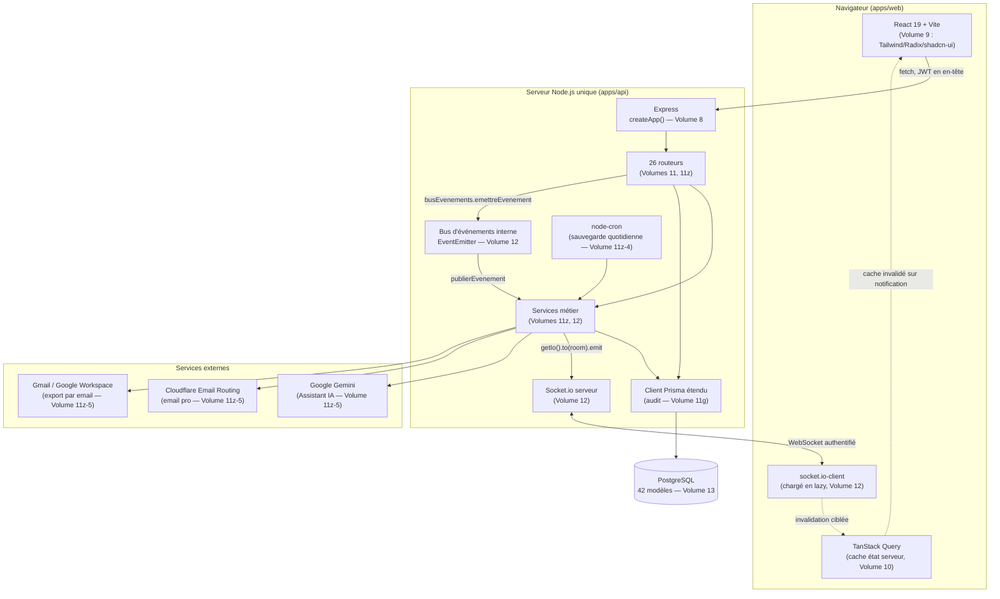
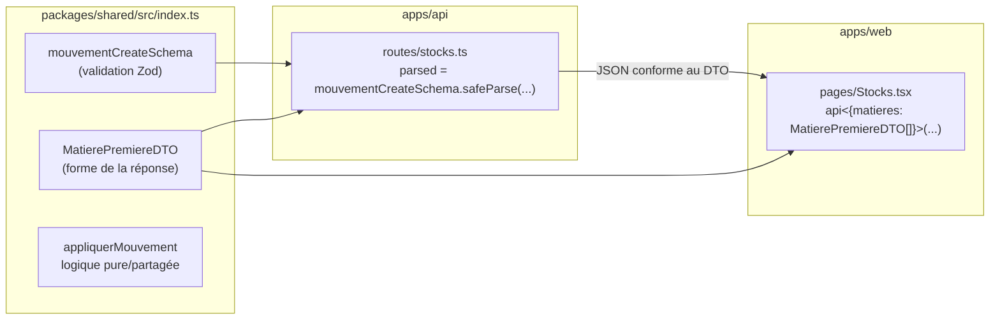
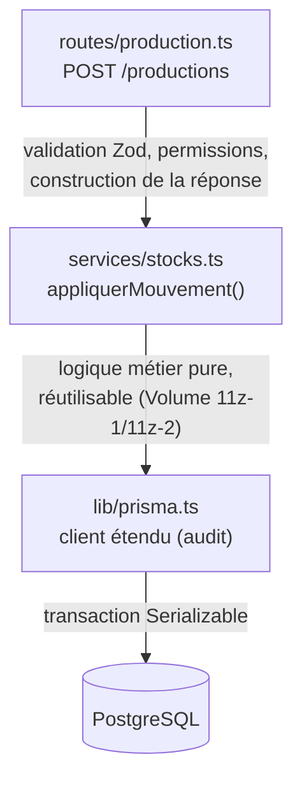
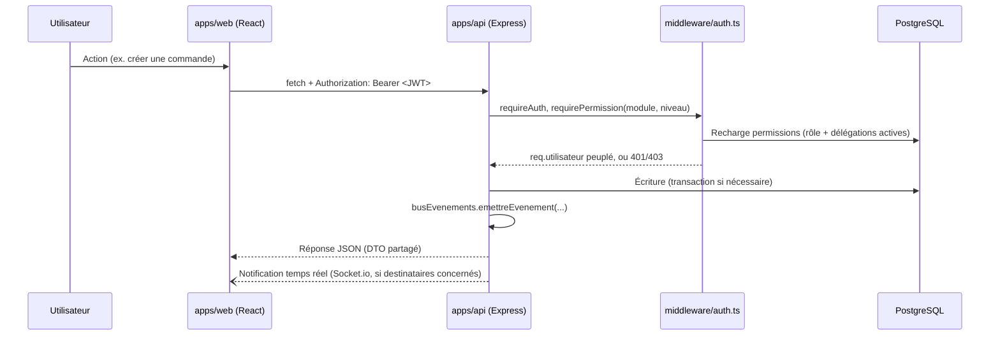

# Volume 6 — Architecture générale

**Niveau de risque : 3 — Support/infrastructure.** Ce chapitre est particulier : contrairement à tous les autres, il ne repose sur aucune nouvelle lecture de code. C'est une **synthèse visuelle** de ce que les Volumes 7, 8, 11b et 12 ont déjà établi en détail, chapitre par chapitre — l'objectif est de donner au lecteur une carte d'ensemble, maintenant que les briques individuelles ont toutes été expliquées.

## 1. Vue d'ensemble

Un seul processus Node.js sert **à la fois** l'API REST, le frontend compilé (repli SPA, Volume 8) et le serveur Socket.io — pas de microservices, pas de passerelle séparée. C'est un choix délibéré, cohérent avec la cible de déploiement (Render, offre gratuite, Volume 5/21) : un unique service web, une seule base PostgreSQL managée, aucune infrastructure à orchestrer entre plusieurs composants.

## 2. Le monorepo et la circulation d'un type

Trois paquets npm (Volume 7), reliés par les *workspaces* npm (Volume 3) — `packages/shared` n'est jamais compilé séparément, il est importé comme source TypeScript brute par les deux autres. Un seul point d'import (`@lomoto/shared`) porte toute la surface de contrat entre client et serveur : types, schémas Zod, DTO, fonctions de calcul pures.

Exemple concret, suivi de bout en bout — déjà rencontré dispersé dans les Volumes 11h et 11z-1, ici assemblé en une seule vue :

Le même `mouvementCreateSchema` valide la requête **côté serveur** (jamais fait confiance au client, Volume 15 à venir) et peut être réutilisé **côté client** pour un retour immédiat avant même l'envoi de la requête — bénéfice concret déjà souligné à plusieurs reprises (ex. `calculerCommande` réutilisée telle quelle pour l'aperçu instantané d'une commande, Volume 11h). Le même `MatierePremiereDTO` décrit exactement la forme de la réponse JSON des deux côtés — un changement de forme du contrat casse la compilation TypeScript **avant** d'atteindre la production, pas après.

## 3. Séparation des responsabilités : routes → services → Prisma

Convention transversale déjà posée au Volume 7 et vérifiée dans chaque chapitre applicatif depuis : `routes/` porte la logique HTTP (validation d'entrée, codes de statut, forme de la réponse) ; `services/` porte une logique réutilisable **indépendante** du contexte HTTP, appelée par une ou plusieurs routes mais qui ne connaît jamais `req`/`res` directement (exception unique documentée au Volume 11f : `actionsCritiques.ts`, qui reçoit `req` pour lire l'auteur de l'action).

Ce triangle routes → services → Prisma se répète à l'identique dans chacun des ~26 routeurs du projet (Volumes 11, 11z) — jamais une route n'accède directement à une logique de décrémentation de stock sans passer par `appliquerMouvement`, jamais un service ne construit lui-même une réponse HTTP. C'est cette discipline, plus que la complexité de chaque fonctionnalité individuelle, qui explique pourquoi un mécanisme comme la décrémentation automatique du stock (Volume 11z-1) se retrouve **réutilisé à l'identique**, sans variation, par trois appelants distincts (mouvement manuel, réception fournisseur, production).

## 4. Le cycle d'une requête authentifiée, en une image

Détaillé en diagramme de séquence complet au Volume 11b ; ici, la version condensée pour la vue d'ensemble :

Trois garanties déjà établies séparément se combinent ici : la permission est **toujours revérifiée côté serveur** à chaque requête, jamais mise en cache côté client au-delà du confort d'affichage (Volume 10) ; la réponse HTTP et l'éventuelle notification temps réel partent du **même événement métier**, jamais désynchronisées (Volume 12) ; et le DTO renvoyé est le même type TypeScript que celui attendu par l'écran qui a déclenché l'action (§2 ci-dessus).

## 5. Croisement avec `docs/spec-boulangerie.md`

Section 7 (« Stack technique recommandée »), déjà largement vérifiée fichier par fichier dans les Volumes 3, 8 et 12 : Node.js/Express/Prisma/PostgreSQL/Socket.io/JWT côté serveur, React/Vite/TanStack Query côté client, EventEmitter Node comme émetteur d'événements interne — chaque brique de cette section trouve sa correspondance exacte dans le code, déjà confirmée volume par volume. Aucun écart.

## 6. Résumé

Ce chapitre ne révèle rien de nouveau — c'est son intérêt : en assemblant les Volumes 7, 8, 11b, 12 et 13 en trois diagrammes, il rend visible une propriété qui n'apparaît qu'en prenant du recul : le projet n'a **pas** de couche d'architecture séparée et documentée à part — l'architecture est le produit direct de conventions appliquées avec une remarquable constance à travers plus de 25 fichiers de routes et une douzaine de services, plutôt que d'un framework ou d'un patron imposé de l'extérieur.

---

**Suite →** Volume 14 — Authentification, autorisations et sécurité (synthèse transversale), qui reprend cette même démarche de consolidation appliquée spécifiquement aux mécanismes de sécurité déjà expliqués en détail dans les Volumes 11b, 11c et 12.
