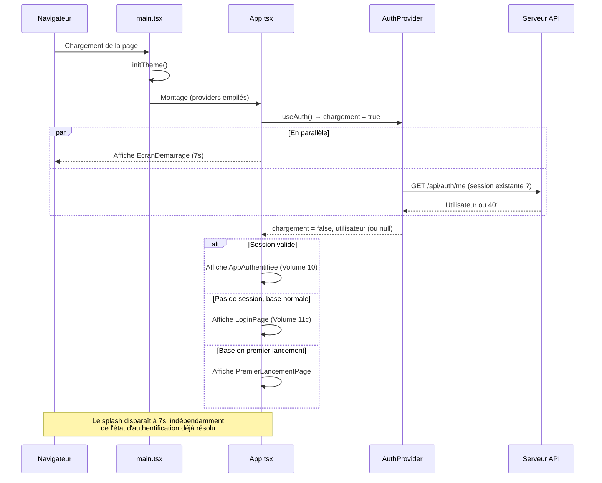

# Volume 8 — Cycle de démarrage de l'application

**Niveau de risque : mixte.** `apps/api/src/app.ts` est Niveau 2 (traitement complet, par fichier et par symbole) ; `apps/api/src/index.ts` et `apps/web/src/main.tsx` sont Niveau 3 (concis). Ce chapitre trace le chemin exact parcouru par le code, du lancement du processus jusqu'au premier écran affiché à l'utilisateur, côté serveur puis côté client.

## Fiche d'identité

| Fichier | Lignes | Niveau | Rôle |
|---|---:|:---:|---|
| `apps/api/src/index.ts` | 18 | 3 | Point d'entrée du process serveur |
| `apps/api/src/app.ts` | 125 | 2 | Assemblage de l'application Express |
| `apps/web/src/main.tsx` | 38 | 3 | Point d'entrée React |
| `apps/web/src/App.tsx` (partiel — le reste au Volume 10) | 244 | 2 | Orchestration démarrage/authentification |
| `apps/web/src/components/EcranDemarrage.tsx` | 101 | 3 | Écran de démarrage (splash) |

## 5.1 Démarrage du serveur — de `index.ts` à l'écoute HTTP

```ts
// apps/api/src/index.ts
import "dotenv/config";
import { createServer } from "node:http";
import { createApp } from "./app.js";
import { logger } from "./lib/logger.js";
import { initRealtime } from "./lib/realtime.js";
import { initNotificationService } from "./services/notifications.js";
import { initPlanificateurSauvegarde } from "./services/planificateurSauvegarde.js";

const port = Number(process.env.PORT ?? 3001);

const httpServer = createServer(createApp());
initRealtime(httpServer);
initNotificationService();
initPlanificateurSauvegarde();

httpServer.listen(port, () => {
  logger.info("API Boulangerie Lomoto démarrée", { url: `http://localhost:${port}`, transport: "HTTP + Socket.io" });
});
```

Cinq étapes séquentielles, dans un ordre qui a son importance :

1. **`import "dotenv/config"`** — la toute première ligne exécutée : charge `.env` (Volume 5) dans `process.env` **avant** que quoi que ce soit d'autre ne s'exécute, garantissant que `JWT_SECRET`, `DATABASE_URL` et les autres variables sont disponibles dès l'import des modules suivants.
2. **`createServer(createApp())`** — `createApp()` (§5.2) construit et renvoie l'application Express complète (routes, middlewares) ; `createServer` l'enveloppe dans un serveur HTTP natif Node.js plutôt que d'utiliser `app.listen()` directement — nécessaire pour que le **même** serveur HTTP puisse ensuite être partagé avec Socket.io à l'étape suivante (Express seul ne gère pas les WebSockets).
3. **`initRealtime(httpServer)`** — attache Socket.io à ce même serveur HTTP (Volume 12, à venir) : les connexions WebSocket et les requêtes HTTP classiques partagent désormais le même port.
4. **`initNotificationService()`** — s'abonne au bus d'événements interne (`busEvenements`, déjà croisé aux volumes 11f/11h/11k-2) pour transformer chaque événement métier en notification persistée puis poussée en temps réel (Volume 12).
5. **`initPlanificateurSauvegarde()`** — programme la tâche cron de sauvegarde quotidienne (Volume 23, à venir).

Le serveur ne commence à écouter (`httpServer.listen`) qu'**après** que ces quatre initialisations aient eu lieu — aucune requête ne peut donc arriver avant que le temps réel, les notifications et le planificateur ne soient prêts.

## 5.2 `createApp()` — l'assemblage de l'application Express

```ts
// apps/api/src/app.ts
export function createApp() {
  const app = express();
  app.set("trust proxy", true);

  app.use((req, res, next) => {
    if (req.hostname === DOMAINE_A_REDIRIGER) {
      return res.redirect(301, `https://${DOMAINE_CANONIQUE}${req.originalUrl}`);
    }
    next();
  });

  app.use(cors({ origin: verifierOrigine, credentials: true }));
  app.use(express.json({ limit: "5mb" }));

  app.get("/api/health", (_req, res) => res.json({ status: "ok", app: "Boulangerie Lomoto API" }));

  app.use("/api/auth", authRouter);
  // ... 25 autres routeurs montés, un par domaine ...

  // Frontend compilé, 404 JSON, gestion d'erreurs — voir plus bas
  return app;
}
```

**L'ordre de montage des middlewares est significatif** — chaque requête traverse cette chaîne dans l'ordre exact où elle est écrite :

1. **`trust proxy`** : indique à Express de faire confiance aux en-têtes `X-Forwarded-*` posés par le proxy inverse de l'hébergeur (Render) — sans cela, `req.hostname`/`req.protocol` refléteraient le proxy interne plutôt que le domaine réellement visité par le navigateur, cassant la redirection canonique qui suit immédiatement.
2. **Redirection canonique** : un middleware maison, posé **avant tout le reste**, qui redirige (`301`, permanent) le domaine secondaire vers le domaine canonique — placé en premier précisément pour s'appliquer même aux requêtes `/api` et `/socket.io`, pas seulement aux pages HTML.
3. **CORS** (`verifierOrigine`, Volume 14 à venir) — décide quelles origines peuvent appeler l'API avec les identifiants (`credentials: true`, nécessaire pour que le navigateur transmette le cookie ou l'en-tête d'autorisation selon le mécanisme choisi).
4. **`express.json({ limit: "5mb" })`** — la limite par défaut d'Express (100 Ko) est explicitement relevée à 5 Mo. Le commentaire du code en donne la raison précise : l'Assistant (spec 3.19, Volume 18) transmet des captures d'écran encodées en base64 **directement dans le corps JSON** plutôt que par un envoi de fichier séparé — une image encodée en base64 est environ 33 % plus volumineuse que le fichier binaire d'origine, d'où une marge large plutôt qu'un calcul serré.
5. **`GET /api/health`** — la route de vérification de santé (Volume 5, `healthCheckPath` de `render.yaml`), déclarée avant les 26 routeurs métier.
6. **Les 26 routeurs** (Volume 7, §5.2) — chacun monté sur son propre préfixe (`/api/commandes`, `/api/caisse`...), chacun responsable de sa propre authentification/autorisation en interne (`requireAuth`/`requirePermission`, Volume 11b) : `app.ts` ne fait aucune vérification de permission lui-même, il ne fait qu'aiguiller par chemin d'URL.

### Servir le frontend compilé — une seule origine, un seul service

```ts
const webDist = process.env.WEB_DIST ?? path.resolve(__dirname, "../../web/dist");
if (fs.existsSync(path.join(webDist, "index.html"))) {
  app.use(express.static(webDist));
  app.get("*", (req, res, next) => {
    if (req.path.startsWith("/api")) return next();
    res.sendFile(path.join(webDist, "index.html"));
  });
}
app.use("/api", (_req, res) => res.status(404).json({ erreur: "Ressource introuvable" }));
```

Ce bloc n'a d'effet que si un build du frontend existe réellement sur le disque (`fs.existsSync`) — en développement, où Vite sert le frontend séparément avec son propre serveur (Volume 5, `render.yaml` : *« En dev, le frontend est servi par Vite [...] En production, il n'y a plus de proxy »*), ce dossier n'existe pas et ce bloc entier est ignoré silencieusement. En production (Volume 5, `render.yaml`), le build web existe : `express.static` sert les fichiers compilés (JS, CSS, images), et le **repli SPA** (`app.get("*", ...)`) renvoie `index.html` pour toute route qui n'est ni un fichier statique existant ni un chemin `/api` — c'est ce qui permet à React Router (Volume 10) de gérer côté client des URL comme `/commandes` ou `/travailleurs` sans que le serveur n'ait besoin de connaître ces routes lui-même. La garde `if (req.path.startsWith("/api")) return next()` évite qu'une route `/api` mal orthographiée ou inexistante ne reçoive par erreur la page HTML plutôt qu'une erreur JSON claire — elle retombe sur le gestionnaire `404` suivant.

### Gestion d'erreurs centralisée

```ts
app.use((err: unknown, req: express.Request, res: express.Response, _next: express.NextFunction) => {
  logger.error("Erreur non gérée", { erreur: err, methode: req.method, chemin: req.path });
  res.status(500).json({ erreur: "Erreur interne du serveur" });
});
```

Le dernier middleware de la chaîne — sa signature à **quatre paramètres** (`err` en premier) est ce qui indique à Express qu'il s'agit d'un gestionnaire d'erreurs, appelé chaque fois qu'une route appelle `next(e)` (le motif `catch (e) { next(e); }` déjà rencontré dans absolument toutes les routes couvertes par ce livre, volumes 11a à 11k). Il journalise l'erreur complète côté serveur (Volume 16, à venir) mais ne renvoie **jamais** le détail de l'erreur au client — toujours le même message générique, `500`, quelle que soit la cause réelle : un choix de sécurité qui évite qu'une erreur technique (par exemple, un message d'erreur SQL) ne fuite une information sur la structure interne de la base vers un client potentiellement malveillant.

## 5.3 Démarrage du frontend — de `main.tsx` au premier écran

```tsx
// apps/web/src/main.tsx
initTheme();
const queryClient = new QueryClient({ defaultOptions: { queries: { retry: 1, refetchOnWindowFocus: false } } });

createRoot(document.getElementById("root")!).render(
  <StrictMode>
    <QueryClientProvider client={queryClient}>
      <BrowserRouter>
        <ThemeProvider>
          <AuthProvider>
            <SocketProvider>
              <FeedbackProvider>
                <App />
              </FeedbackProvider>
            </SocketProvider>
          </AuthProvider>
        </ThemeProvider>
      </BrowserRouter>
    </QueryClientProvider>
  </StrictMode>,
);
```

**`initTheme()`, appelé avant le premier rendu** : pose (ou non) la classe `.dark` sur `<html>` selon la préférence déjà enregistrée (`localStorage`) ou, à défaut, celle du système d'exploitation. Le commentaire du code explique pourquoi cet appel doit précéder le rendu React plutôt que d'être un effet posé dans un composant : sans cela, l'application afficherait le thème clair pendant une fraction de seconde avant de basculer vers le sombre — un effet visuel de scintillement (*flash of unstyled theme*) que cet appel préventif évite.

**L'empilement des fournisseurs de contexte React** suit un ordre de dépendance, de l'extérieur vers l'intérieur : `QueryClientProvider` (TanStack Query, Volume 10) englobe tout, car le cache de requêtes est utile même avant l'authentification (Volume 11c, `état-initial`) ; `BrowserRouter` (React Router) doit englober `AuthProvider` car ce dernier peut déclencher des redirections ; `ThemeProvider` gère la bascule clair/sombre ; `AuthProvider` (Volume 11b) porte l'état d'authentification consommé par `SocketProvider` (qui a besoin du jeton pour s'authentifier auprès de Socket.io, Volume 12) et par `App` lui-même ; `FeedbackProvider` (boîtes de confirmation, notifications ponctuelles) est le plus interne, disponible à tous les écrans.

`defaultOptions.queries.retry: 1` et `refetchOnWindowFocus: false` sont deux choix de configuration globale de TanStack Query : une seule nouvelle tentative automatique en cas d'échec réseau (pas le comportement par défaut, plus agressif), et pas de rafraîchissement automatique au retour de focus sur l'onglet — un choix de sobriété réseau plutôt que de fraîcheur maximale des données.

## 5.4 `App.tsx` — l'aiguillage démarrage/authentification

Ce chapitre ne couvre que la partie de `App.tsx` relative au **démarrage** — l'arbre de routes de l'utilisateur authentifié (`AppAuthentifiee`) est traité au Volume 10.

```tsx
export default function App() {
  const { utilisateur, chargement, premierLancement } = useAuth();
  const [splashFini, setSplashFini] = useState(() => splashDejaVu());
  const terminerSplash = useCallback(() => setSplashFini(true), []);
  const splash = splashFini ? null : <EcranDemarrage onTermine={terminerSplash} />;

  if (chargement) {
    return <>{splash}<ChargementModule plein /></>;
  }
  if (!utilisateur) {
    if (premierLancement) {
      return <>{splash}<Suspense fallback={<ChargementModule plein />}><PremierLancementPage /></Suspense></>;
    }
    return <>{splash}<Routes><Route path="/connexion" element={<LoginPage />} /><Route path="*" element={<Navigate to="/connexion" replace />} /></Routes></>;
  }
  return <>{splash}<AppAuthentifiee /></>;
}
```

**Un point d'architecture central, expliqué en commentaire dans le code lui-même** : l'écran de démarrage (`splash`) n'est **jamais** un obstacle bloquant au chargement réel de l'application — il se **superpose** (`fixed inset-0 z-[100]`, §5.5) à ce que React monte et charge derrière lui. Concrètement, pendant que le splash s'affiche à l'écran, `AuthProvider` (Volume 11b) est déjà en train de vérifier s'il existe une session active (`GET /api/auth/me`) ; quand le splash se termine, la transition vers l'écran de connexion ou le tableau de bord est donc **immédiate**, sans temps de chargement supplémentaire perceptible.

Quatre branches, évaluées dans cet ordre :

1. **`chargement` vrai** — l'état initial, le temps que `AuthProvider` détermine s'il existe une session valide (Volume 11b). Affiche `ChargementModule` en plein écran, sous le splash s'il est encore visible.
2. **Pas d'utilisateur, base en premier lancement** (`premierLancement`, spec section 3.7) — bascule entièrement sur `PremierLancementPage`, chargée en lazy (contrairement à `LoginPage`, toujours dans le bundle principal — le commentaire du code justifie cette différence : l'écran de connexion est l'écran d'entrée normal, un délai de chargement supplémentaire y serait plus gênant que sur l'assistant de premier lancement, affiché une seule fois dans la vie de l'application). **Aucune route n'est accessible** avant la fin de ce parcours.
3. **Pas d'utilisateur, base normale** — un arbre de routes minimal : `/connexion` affiche `LoginPage` (Volume 11c), toute autre URL y redirige.
4. **Utilisateur authentifié** — délègue à `AppAuthentifiee` (Volume 10).

## 5.5 `EcranDemarrage` — le splash, superposé et non bloquant

```tsx
const DUREE_MS = 7000;
const FONDU_MS = 600;
const CLE_SESSION = "lomoto_splash_vu";

export function splashDejaVu(): boolean {
  try { return sessionStorage.getItem(CLE_SESSION) === "1"; }
  catch { return true; } // navigation privée verrouillée : on n'insiste pas
}
```

`sessionStorage` (pas `localStorage`) est le choix technique clé : il **survit à un rafraîchissement d'onglet** mais **pas** à l'ouverture d'un nouvel onglet ou d'une nouvelle session de navigation — exactement le comportement voulu par la spec (section 3.8) : l'écran ne doit apparaître qu'une fois par session, jamais à chaque navigation interne. Le `try/catch` autour de l'accès à `sessionStorage` protège contre le cas où le stockage est verrouillé (certains modes de navigation privée le bloquent) — plutôt que de faire planter l'application, l'écran est simplement considéré comme « déjà vu » dans ce cas, un repli sûr qui privilégie la continuité de service sur l'esthétique.

`DUREE_MS = 7000` (7 secondes) tombe dans la fourchette « 6 à 8 secondes » annoncée par le commentaire du code référant à la spec section 3.8. Le `useEffect` du composant programme deux minuteurs : un premier à `DUREE_MS - FONDU_MS` (6,4 s) qui déclenche la classe CSS de sortie en fondu, un second à `DUREE_MS` pile qui marque l'écran comme vu et appelle `onTermine` — cette dernière fonction, remontée depuis `App.tsx`, est ce qui fait disparaître le splash pour de bon.

## 5.6 Diagramme de séquence



## 5.7 Cas limites

| Situation | Comportement |
|---|---|
| Rafraîchissement de l'onglet en cours de session | Le splash ne réapparaît pas (`sessionStorage` déjà marqué) — seul `ChargementModule` s'affiche le temps de revérifier la session. |
| Navigation privée avec stockage verrouillé | Le splash est traité comme déjà vu, jamais affiché — repli silencieux plutôt qu'un plantage. |
| Requête vers une route `/api/xyz` inexistante, en production | `404` JSON explicite, jamais la page HTML du frontend (garde `startsWith("/api")`, §5.2). |
| Build web absent (`web/dist/index.html` manquant) | Le bloc de service statique est entièrement ignoré — cohérent avec un environnement de développement où Vite sert le frontend séparément. |
| Erreur non gérée dans une route | Toujours `500` générique côté client, jamais le détail technique — quelle que soit la cause réelle de l'erreur. |

## 5.8 Croisement avec la spécification

La durée du splash (6 à 8 secondes, spec section 3.8) correspond exactement aux 7 secondes codées. Aucun autre écart trouvé sur ce chapitre.

## 5.9 Résumé

Le démarrage du serveur enchaîne cinq étapes avant d'écouter le premier port : préparation de l'environnement, assemblage Express, temps réel, notifications, planificateur. `createApp()` assemble 26 routeurs métier autour d'un socle commun (redirection canonique, CORS, limite de charge utile, gestion d'erreurs) qui ne connaît lui-même aucune règle de permission — chaque routeur reste responsable de sa propre sécurité. Côté client, le splash se superpose au chargement réel de l'application plutôt que de le bloquer, garantissant une transition immédiate vers l'écran pertinent (connexion, premier lancement, ou application authentifiée) dès sa disparition.

---

**Suite →** Volume 9 — Interface utilisateur et composants, qui détaille le système de design et la coquille de navigation (`Layout.tsx`) déjà entrevue dans ce chapitre.
