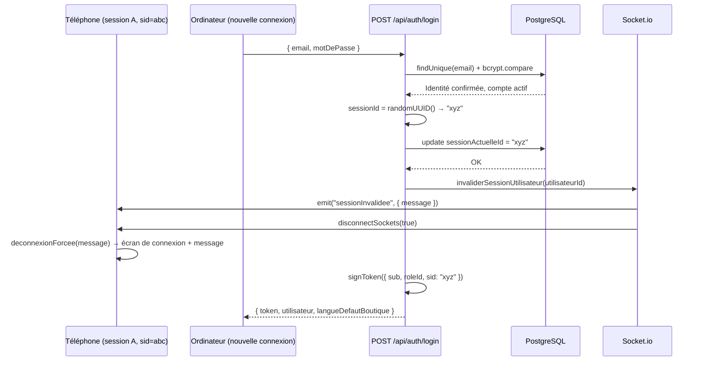

# Volume 11c — Connexion

**Niveau de risque : 1 — Critique.** Traitement exhaustif.

Ce chapitre s'appuie directement sur le Volume 11b (authentification et permissions bout en bout) : il suppose connus `signToken`/`verifyToken`, `chargerUtilisateur`, et le mécanisme de session unique. S'il vous manque ce contexte, lisez d'abord le 11b.

## Fiche d'identité des fichiers couverts

| Fichier | Lignes | Rôle |
|---|---:|---|
| `apps/api/src/routes/auth.ts` | 139 | Les routes qui **produisent** un jeton (connexion) et gèrent le cycle de vie du compte connecté (changement de mot de passe, de langue, consultation de son propre profil) |
| `apps/web/src/pages/Login.tsx` | 170 | L'écran de connexion |

- **Qui les appelle** : `routes/auth.ts` est monté sur `/api/auth` dans `app.ts` ; `Login.tsx` est affiché par `App.tsx` (Volume 10) quand aucun utilisateur n'est chargé et que l'assistant de premier lancement n'est pas actif.
- **Ce qu'ils appellent** : `bcrypt` (vérification/hachage de mot de passe), `signToken` (Volume 11b), `chargerUtilisateur` (Volume 11b), `invaliderSessionUtilisateur` (`lib/realtime.ts`), et côté frontend, `useAuth().login` (Volume 11b).
- **Données modifiées** : `Utilisateur.sessionActuelleId` (à chaque connexion), `Utilisateur.motDePasseHash` (changement de mot de passe), `Utilisateur.languePreferee` (changement de langue).

## 4.1 `POST /api/auth/login` — la route la plus sensible du fichier

### Explication intuitive

Cette route répond à une question à enjeu de sécurité maximal : *cette personne est-elle bien celle qu'elle prétend être ?* Une seule erreur ici — un message qui en dit trop, une comparaison mal faite — peut compromettre n'importe quel compte de l'application. Le code adopte une posture prudente à chaque étape, comme le détail ci-dessous le montre.

### Déroulement étape par étape

```ts
// apps/api/src/routes/auth.ts, route POST /login
authRouter.post("/login", async (req, res, next) => {
  try {
    const parsed = loginSchema.safeParse(req.body);
    if (!parsed.success) {
      return res.status(400).json({ erreur: parsed.error.issues[0]?.message ?? "Données invalides" });
    }
    const { email, motDePasse } = parsed.data;

    const u = await prisma.utilisateur.findUnique({ where: { email } });
    const identifiantsInvalides = () =>
      res.status(401).json({ erreur: "E-mail ou mot de passe incorrect" });

    if (!u) return identifiantsInvalides();
    const ok = await bcrypt.compare(motDePasse, u.motDePasseHash);
    if (!ok) return identifiantsInvalides();

    if (!u.actif) {
      return res.status(401).json({ erreur: "Compte désactivé — contactez un administrateur." });
    }

    const utilisateur = await chargerUtilisateur(u.id);
    if (!utilisateur) return identifiantsInvalides();

    const sessionId = randomUUID();
    await prisma.utilisateur.update({
      where: { id: u.id },
      data: { sessionActuelleId: sessionId },
    });
    invaliderSessionUtilisateur(u.id);

    const token = signToken({ sub: u.id, roleId: u.roleId, sid: sessionId });
    res.json({ token, utilisateur, langueDefautBoutique: await langueDefautBoutique() });
  } catch (e) {
    next(e);
  }
});
```

1. **Validation du format** (`loginSchema.safeParse`) — vérifie que `email` est une adresse syntaxiquement valide et que `motDePasse` est une chaîne non vide, **avant** toute requête à la base de données. `safeParse` (plutôt que `parse`) renvoie un objet `{ success, data | error }` sans jamais lever d'exception — c'est ce qui permet au code de tester `parsed.success` avec un simple `if`, sans bloc `try`/`catch` dédié à la validation (voir Volume 15 pour ce mécanisme en détail).
2. **Recherche du compte par e-mail** (`prisma.utilisateur.findUnique({ where: { email } })`) — l'e-mail est l'identifiant de connexion. `u` vaut `undefined` si aucun compte ne correspond.
3. **Fonction `identifiantsInvalides`, définie une seule fois, appelée à trois endroits différents** — c'est un choix de conception qui a une conséquence de sécurité directe : que la cause de l'échec soit *« cet e-mail n'existe pas »* (étape 2) ou *« le mot de passe est incorrect »* (étape 4), **le message renvoyé à l'appelant est rigoureusement identique** (`"E-mail ou mot de passe incorrect"`, code 401). C'est une pratique de sécurité standard : si les deux cas produisaient des messages distincts (« cet e-mail n'existe pas » vs « mot de passe incorrect »), un attaquant pourrait **énumérer les adresses e-mail valides de l'application** simplement en observant quel message revient pour chaque tentative — une fuite d'information appelée *énumération de comptes*. En fusionnant les deux cas dans une seule fonction partagée, ce risque est structurellement éliminé : il n'existe tout simplement pas de branche de code qui pourrait un jour diverger par erreur.
4. **Vérification du mot de passe** (`bcrypt.compare(motDePasse, u.motDePasseHash)`) — **jamais** de comparaison directe de chaînes (`motDePasse === u.motDePasseHash`, qui serait de toute façon impossible : le mot de passe en clair n'est jamais stocké). `bcrypt.compare` recalcule le hachage du mot de passe fourni avec le même sel que celui utilisé à l'origine (intégré dans `u.motDePasseHash` lui-même) et compare les deux hachages. Cette opération est **volontairement lente** (de l'ordre de quelques dizaines à centaines de millisecondes) — une propriété délibérée de l'algorithme bcrypt qui rend les attaques par force brute beaucoup plus coûteuses qu'avec un hachage rapide comme SHA-256.
5. **Vérification du compte actif** (`if (!u.actif)`) — placée **après** la vérification du mot de passe, pas avant. Ce choix a un sens de sécurité précis, explicité par le commentaire du code : puisque l'identité est déjà prouvée à ce stade (le mot de passe correct a été fourni), il n'y a plus de risque d'énumération à révéler explicitement que ce compte particulier est désactivé — l'information n'est utile qu'à quelqu'un qui connaît déjà le mot de passe, donc probablement le titulaire légitime du compte (ou quelqu'un à qui il l'a communiqué), pas un attaquant en phase de reconnaissance.
6. **Reconstruction complète du DTO utilisateur** (`chargerUtilisateur(u.id)`, Volume 11b) — recalcule rôle, permissions fusionnées et délégations actives, exactement comme le ferait n'importe quelle requête authentifiée ultérieure.
7. **Génération d'un nouvel identifiant de session** (`randomUUID()`, natif de Node.js) — un UUID v4 aléatoire, imprévisible, qui devient le nouveau `sid` de ce compte.
8. **Écriture immédiate en base** (`prisma.utilisateur.update(...)`) — **avant** même de signer le jeton. C'est l'étape qui invalide, de fait, n'importe quelle session précédente sur ce compte : le prochain `requireAuth` qui verra passer un jeton avec l'ancien `sid` le comparera à cette nouvelle valeur et le rejettera (Volume 11b, §3.4).
9. **Notification temps réel de l'ancien appareil** (`invaliderSessionUtilisateur(u.id)`) — voir §4.2 ci-dessous, c'est ce qui permet à un appareil déjà connecté d'être déconnecté **immédiatement**, sans attendre sa prochaine requête HTTP.
10. **Signature du nouveau jeton** (`signToken({ sub: u.id, roleId: u.roleId, sid: sessionId })`) et **réponse** — le jeton, l'utilisateur complet, et la langue par défaut de la boutique (nécessaire pour que l'interface s'affiche dans la bonne langue dès le premier rendu, avant même que l'utilisateur ait pu choisir une préférence personnelle).

### Pourquoi l'écriture en base a lieu AVANT la notification temps réel

L'ordre entre l'étape 8 (écriture) et l'étape 9 (notification Socket.io) n'est pas interchangeable sans risque : si la notification partait avant que la base soit mise à jour, un appareil recevant l'événement `sessionInvalidee` et réagissant instantanément par une nouvelle requête HTTP pourrait, en théorie, arriver au serveur avant que l'écriture ne soit confirmée — un cas de compétition de données (*race condition*) qui laisserait passer une requête avec un `sid` déjà obsolète mais pas encore rejeté. En écrivant d'abord, ce risque est éliminé : au moment où la notification part, la base est déjà dans son état final.

## 4.2 `invaliderSessionUtilisateur` — le pont vers le temps réel

```ts
// apps/api/src/lib/realtime.ts
export function invaliderSessionUtilisateur(utilisateurId: string): void {
  if (!io) return;
  const room = roomUtilisateur(utilisateurId);
  io.to(room).emit("sessionInvalidee", { message: MESSAGE_SESSION_REMPLACEE });
  io.in(room).disconnectSockets(true);
}
```

Cette fonction (détaillée dans son ensemble au Volume 12, API et communications réseau) fait deux choses : elle **émet** un événement Socket.io `sessionInvalidee` vers la « salle » (room) de l'utilisateur concerné — reçu côté client par `apps/web/src/lib/socket.tsx`, qui appelle alors `deconnexionForcee` (Volume 11b, §3.7) — puis elle **déconnecte de force** le socket lui-même (`disconnectSockets(true)`), pour qu'aucune donnée supplémentaire ne transite plus vers cet appareil après ce point. Le garde `if (!io) return;` protège contre le cas où le serveur Socket.io ne serait pas encore initialisé (fenêtre très brève au tout début du démarrage du serveur, voir Volume 8) — dans ce cas, seule la voie HTTP (le prochain `requireAuth` qui échouera) prendra le relais.

## 4.3 Les routes secondaires du fichier

| Route | Méthode | Protection | Rôle |
|---|:---:|---|---|
| `/api/auth/etat-initial` | GET | Aucune (publique) | Indique si la base ne contient **aucun** compte (`prisma.utilisateur.count() === 0`) — c'est ce booléen qui décide, côté frontend, d'afficher l'Assistant de premier lancement plutôt que l'écran de connexion (Volume 8) |
| `/api/auth/me` | GET | `requireAuth` | Renvoie l'utilisateur courant tel que `requireAuth` vient de le reconstruire — utilisé au chargement de l'application pour revalider un jeton déjà en `localStorage` (Volume 11b, §3.7) |
| `/api/auth/langue-defaut` | GET | Aucune (publique) | La langue par défaut de la boutique, nécessaire pour afficher l'écran de connexion lui-même dans la bonne langue, avant toute authentification |
| `/api/auth/langue` | PUT | `requireAuth` | Change la préférence de langue personnelle de l'utilisateur connecté (Volume 17) |
| `/api/auth/mot-de-passe` | POST | `requireAuth` | Change son propre mot de passe — voir §4.4 |

**Pourquoi `/etat-initial` et `/langue-defaut` sont-elles délibérément publiques ?** Elles doivent répondre **avant** que quiconque soit connecté — un système d'authentification qui exigerait d'être authentifié pour savoir comment s'authentifier serait un verrou sans porte. Aucune de ces deux routes n'expose de donnée sensible : la première ne révèle qu'un booléen, la seconde qu'un code de langue.

## 4.4 `POST /api/auth/mot-de-passe` — changer son propre mot de passe

```ts
authRouter.post("/mot-de-passe", requireAuth, async (req, res, next) => {
  // ...
  const u = await prisma.utilisateur.findUniqueOrThrow({ where: { id: req.utilisateur!.id } });
  const ok = await bcrypt.compare(motDePasseActuel, u.motDePasseHash);
  if (!ok) return res.status(401).json({ erreur: "Mot de passe actuel incorrect" });

  await prisma.utilisateur.update({
    where: { id: u.id },
    data: { motDePasseHash: await bcrypt.hash(nouveauMotDePasse, 10) },
  });
  res.status(204).end();
});
```

Cette route exige de connaître **l'ancien mot de passe** avant d'en accepter un nouveau — même pour l'utilisateur qui modifie son propre compte, déjà authentifié par un jeton valide. C'est une défense supplémentaire contre un scénario précis : un appareil resté connecté (session ouverte, jeton valide en mémoire) mais laissé sans surveillance — sans cette vérification, quiconque a un accès physique momentané à cet appareil pourrait changer le mot de passe et prendre le contrôle définitif du compte. `motDePasseUpdateSchema` (Volume 15) impose au passage un nouveau mot de passe d'au moins 8 caractères.

Notez que `bcrypt.hash(nouveauMotDePasse, 10)` régénère un hachage entièrement nouveau, avec un nouveau sel aléatoire — jamais une simple modification du hachage existant. Le facteur `10` est le *cost factor* de bcrypt (nombre de tours de calcul, en puissance de 2) : une valeur standard qui équilibre résistance à la force brute et temps de réponse acceptable pour l'utilisateur légitime.

**Absence volontaire de changement de session** : contrairement à `/login`, cette route ne régénère pas `sessionActuelleId`. **Non confirmé dans le code actuel** que ce soit un choix explicite documenté ailleurs — une conséquence observable est qu'après un changement de mot de passe, la session en cours reste valide, et une éventuelle session parallèle ouverte ailleurs par un tiers malveillant (si le mot de passe avait fuité) ne serait pas automatiquement coupée par ce seul changement de mot de passe.

## 4.5 `apps/web/src/pages/Login.tsx` — l'écran de connexion

### Ce qu'il fait au-delà de l'affichage

La quasi-totalité de ce fichier (170 lignes) est de la mise en forme visuelle (panneau de marque, dégradés, logo — voir Volume 9 pour le système de design). La logique fonctionnelle tient en une poignée de lignes :

```tsx
async function onSubmit(e: FormEvent) {
  e.preventDefault();
  setErreur(null);
  setEnCours(true);
  try {
    await login(email, motDePasse);
  } catch (err) {
    setErreur(err instanceof Error ? err.message : t("login.error"));
  } finally {
    setEnCours(false);
  }
}
```

1. `e.preventDefault()` — empêche le comportement par défaut du navigateur (rechargement complet de la page lors de la soumission d'un formulaire HTML), pour rester dans le cycle de vie de l'application React.
2. `login(email, motDePasse)` — délègue entièrement à `useAuth().login` (Volume 11b, §3.7), qui appelle `POST /api/auth/login` via `api()` et met à jour le contexte global si la connexion réussit.
3. En cas d'échec, l'erreur levée par `api()` (une `ApiError`, Volume 11b §3.6) porte déjà le message en français renvoyé par le serveur (`"E-mail ou mot de passe incorrect"`, etc.) — affiché tel quel, sans traduction supplémentaire à ce stade.
4. `enCours` désactive le bouton et affiche un indicateur de chargement pendant l'attente de la réponse — empêche une double soumission accidentelle par un clic répété.

### L'affichage du message de session remplacée

```tsx
{messageSessionRemplacee && (
  <p role="status" ...>
    <Info aria-hidden className="..." />
    {messageSessionRemplacee}
  </p>
)}
```

`messageSessionRemplacee` vient directement du contexte d'authentification (Volume 11b, §3.7) — c'est ce texte qui s'affiche automatiquement quand `deconnexionForcee` a été déclenchée juste avant l'arrivée sur cet écran, expliquant à l'utilisateur *pourquoi* il se retrouve soudainement sur la page de connexion plutôt que de le laisser deviner.

## 4.6 Diagramme de séquence — connexion avec déconnexion d'un appareil concurrent



## 4.7 Cas limites et erreurs fréquentes

| Situation | Comportement |
|---|---|
| E-mail inexistant | 401, message générique (§4.1, étape 3) |
| Mot de passe incorrect | 401, **message identique** au cas précédent |
| Compte désactivé, mot de passe correct | 401, message **spécifique** (« Compte désactivé... ») — voir §4.1, étape 5 pour la justification de sécurité de cette asymétrie |
| Corps de requête malformé (ex. `email` absent) | 400, message de validation Zod |
| Session déjà remplacée entre le chargement de la page et la soumission | Sans effet sur `/login` elle-même (qui ne dépend pas d'une session existante) — s'appliquerait à la requête suivante d'une session concurrente, pas à la tentative de connexion en cours |
| Régénérer un mot de passe sans le connaître (compte perdu) | **Non confirmé dans le code actuel** qu'une procédure de réinitialisation de mot de passe (« mot de passe oublié ») existe — aucune route de ce type n'a été repérée dans `routes/auth.ts`. Un compte bloqué nécessite l'intervention d'un Administrateur (à confirmer au Volume 22, Guide d'utilisation). |

## Croisement avec la spécification

| Comportement | Section de `docs/spec-boulangerie.md` | Correspondance |
|---|---|---|
| Session unique, déconnexion immédiate de l'ancien appareil avec message explicite | 3.7 : *« Une nouvelle connexion invalide automatiquement la session précédente ; l'ancien appareil est déconnecté (en temps réel s'il est encore ouvert, sinon à sa prochaine requête) avec un message explicite »* | **Conforme**, y compris la nuance temps réel vs prochaine requête (§4.2 et Volume 11b §3.4) |
| Compte désactivé → refus de connexion explicite | 3.14 : *« l'utilisateur désactivé ne peut plus se connecter »* | **Conforme** |

Aucun écart repéré pour ce chapitre.

## Résumé du chapitre

`POST /api/auth/login` vérifie l'identité par un hachage bcrypt lent, renvoie systématiquement le même message d'erreur pour un e-mail inexistant ou un mot de passe incorrect (contre l'énumération de comptes), ne révèle qu'un compte est désactivé qu'une fois l'identité prouvée, puis génère un nouvel identifiant de session qui invalide toute connexion concurrente — en base d'abord, puis en temps réel via Socket.io. Le changement de mot de passe exige de reconfirmer l'ancien, même pour un compte déjà authentifié. Côté interface, `Login.tsx` délègue toute la logique à `useAuth().login` et se contente d'afficher le résultat, y compris le message dédié d'une déconnexion forcée.

**Fichiers marqués « Vérifié » à l'issue de ce chapitre** : `apps/api/src/routes/auth.ts`, `apps/web/src/pages/Login.tsx`.

**Suite** → Volume 11d : Équipe, rôles et permissions (`routes/equipe.ts`, `routes/roles.ts`, `pages/Equipe.tsx`) — y compris la faille de sécurité découverte et corrigée dans ce dépôt sur le transfert du statut d'Administrateur Principal.
