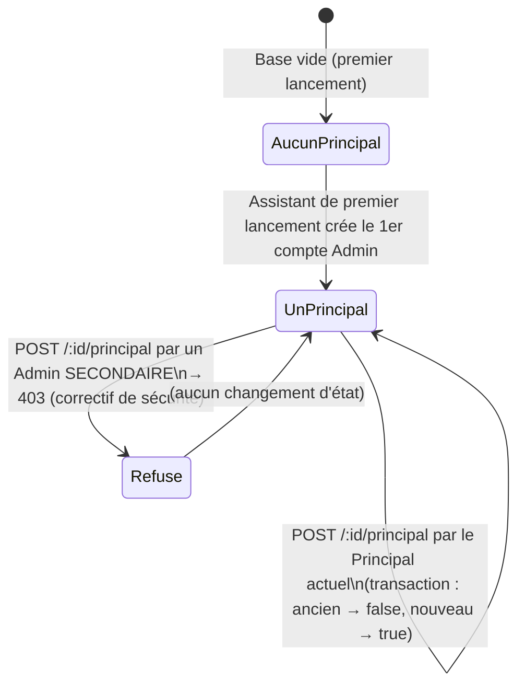

# Volume 11d — Équipe, rôles et permissions

**Niveau de risque : 1 — Critique.** Traitement exhaustif.

Ce chapitre s'appuie sur les Volumes 11a (fonction `aAcces`) et 11b (garde `requirePermission`, statut `estAdminPrincipal`). Il introduit `traiterActionCritique`, dont le fonctionnement complet est détaillé au Volume 11f (Approbations) — ce chapitre n'en donne que ce qui est nécessaire pour comprendre `routes/equipe.ts`.

## Fiche d'identité des fichiers couverts

| Fichier | Lignes | Rôle |
|---|---:|---|
| `apps/api/src/routes/equipe.ts` | 267 | Gestion des comptes utilisateurs : création, modification, activation/désactivation, transfert du statut Admin Principal, suppression |
| `apps/api/src/routes/roles.ts` | 53 | Consultation et modification de la matrice de permissions par rôle |
| `apps/web/src/pages/Equipe.tsx` | 700 | Écran de gestion de l'équipe, des rôles (lecture) et des délégations temporaires |

- **Qui les appelle** : `equipeRouter` et `rolesRouter` sont montés sur `/api/equipe` et `/api/roles` dans `app.ts` ; `EquipePage` est affichée par la route `/equipe` de `App.tsx`, protégée par `RequiertLecture module="EQUIPE"`.
- **Ce qu'ils appellent** : `bcrypt` (hachage du mot de passe initial), `traiterActionCritique` (Volume 11f), `busEvenements` (Volume 12), et les fonctions du Volume 11b (`requirePermission`).
- **Données modifiées** : `Utilisateur` (création, `roleId`, `actif`, `estAdminPrincipal`), `Travailleur.utilisateurId` (liaison à la création d'un compte), `RolePermission` (via `roles.ts`).

## 5.1 Vue d'ensemble intuitive

Ce chapitre couvre l'écran où l'on décide *qui* peut faire *quoi* dans l'application — la source de tous les droits vérifiés au Volume 11b. Trois notions s'y croisent : le **compte** (une personne qui se connecte), le **rôle** (un ensemble de droits nommé, ex. « Caissier(ère) »), et un statut spécial, **Administrateur Principal**, qui n'est pas un rôle mais un simple indicateur (un seul compte à la fois) donnant un accès total. C'est précisément la gestion de ce dernier statut qui a fait l'objet d'une faille de sécurité réelle dans ce projet, corrigée et documentée en détail au §5.6.

## 5.2 `verifierQuotaAdmins` — la limite des 3 comptes Administrateur

```ts
// apps/api/src/routes/equipe.ts
async function verifierQuotaAdmins(roleId: string, ignorerId?: string): Promise<string | null> {
  const role = await prisma.role.findUnique({ where: { id: roleId } });
  if (!role) return "Rôle introuvable";
  if (role.nom !== ROLE_ADMINISTRATEUR) return null;
  const admins = await prisma.utilisateur.count({
    where: { role: { nom: ROLE_ADMINISTRATEUR }, ...(ignorerId ? { id: { not: ignorerId } } : {}) },
  });
  return admins >= MAX_COMPTES_ADMIN
    ? `Limite atteinte : au plus ${MAX_COMPTES_ADMIN} comptes Administrateur (1 Principal + 2 secondaires)`
    : null;
}
```

Une fonction utilitaire, appelée à deux endroits (création de compte §5.3, réaffectation de rôle §5.5), qui renvoie soit `null` (aucun problème), soit un message d'erreur explicite prêt à être renvoyé tel quel au client. Son déroulement :

1. Si le rôle visé n'existe pas, renvoie l'erreur correspondante.
2. **Si le rôle visé n'est pas « Administrateur », la fonction s'arrête immédiatement** (`return null`) — le quota ne concerne que ce rôle précis, aucun autre rôle n'est limité en nombre de comptes.
3. Compte les comptes existants portant le rôle Administrateur, en excluant optionnellement `ignorerId` — ce paramètre sert à ne pas compter deux fois le compte en cours de modification (changer le *nom* d'un Admin existant ne doit pas déclencher une fausse alerte de quota).
4. Compare au maximum (`MAX_COMPTES_ADMIN`, une constante de `packages/shared/src/index.ts` valant 3, conforme à la spec : *« jusqu'à 3 comptes »*, 1 Principal + 2 secondaires).

## 5.3 `POST /api/equipe` — créer un compte

### Ce que cette route fait de particulier : pas d'e-mail libre

```ts
const travailleur = await prisma.travailleur.findUnique({ where: { id: travailleurId } });
if (!travailleur) return res.status(404).json({ erreur: "Fiche Travailleur introuvable" });
if (travailleur.utilisateurId) {
  return res.status(409).json({ erreur: "Cette fiche a déjà un compte de connexion" });
}
if (travailleur.emailProStatut !== "ACTIF" || !travailleur.emailProAdresse) {
  return res.status(409).json({ erreur: "L'adresse email professionnelle de cette fiche n'est pas encore active" });
}
const nom = travailleur.nom;
const email = travailleur.emailProAdresse;
```

Un compte de connexion ne se crée **jamais** en saisissant un e-mail au clavier. Il faut d'abord une fiche `Travailleur` (Volume 11k) dont l'adresse professionnelle (générée via Cloudflare Email Routing, Volume 11z) est au statut `ACTIF` — l'e-mail du compte est **automatiquement** celui de cette fiche, non modifiable à la création. Trois vérifications successives, chacune avec son propre code d'erreur : la fiche existe (404 sinon), elle n'a pas déjà de compte lié (409), son e-mail pro est actif (409). Cette contrainte est un choix de conception déjà en place au moment de l'audit de ce dépôt (voir la formulation *« nouveau »* dans le commentaire du code, qui indique une évolution volontaire) — elle garantit qu'un compte de connexion correspond toujours à une personne réellement identifiée dans le registre du personnel.

### Aiguillage : compte ordinaire vs compte Administrateur

```ts
if (role.nom === ROLE_ADMINISTRATEUR) {
  const quota = await verifierQuotaAdmins(roleId);
  if (quota) return res.status(409).json({ erreur: quota });
  const r = await traiterActionCritique(
    req, "CREER_COMPTE_ADMIN",
    { nom, email, roleId, motDePasseHash, travailleurId: travailleur.id },
    `créer le compte Administrateur « ${nom} » (${email})`,
  );
  return res.status(r.http).json(r.body);
}

const compte = await prisma.$transaction(async (tx) => {
  const c = await tx.utilisateur.create({ data: { nom, email, roleId, motDePasseHash }, include: INCLUDE_COMPTE });
  await tx.travailleur.update({ where: { id: travailleur.id }, data: { utilisateurId: c.id } });
  return c;
});
res.status(201).json({ compte: versCompteDTO(compte) });
```

Créer un compte **Administrateur** est l'une des 5 tâches critiques de la spécification (section 2). Le code vérifie d'abord le quota (§5.2) — **avant** même de passer la main à `traiterActionCritique` — puis délègue entièrement l'exécution (immédiate si l'auteur est déjà l'Admin Principal, différée en approbation sinon, Volume 11f) à cette fonction commune. **Notez que le mot de passe est déjà haché (`motDePasseHash`) avant d'être transmis** à `traiterActionCritique` — y compris dans le cas où l'action serait mise en attente d'approbation : le mot de passe en clair ne transite jamais au-delà de cette fonction, ni ne se retrouve stocké tel quel dans une `DemandeApprobation` en attente.

Pour tout **autre** rôle, la création est directe, dans une transaction Prisma à deux opérations : créer le compte, puis lier la fiche `Travailleur` d'origine à ce nouveau compte (`utilisateurId`). L'utilisation d'une transaction (`prisma.$transaction`) garantit que ces deux écritures réussissent ou échouent **ensemble** — si la seconde échouait après que la première ait réussi, la base se retrouverait avec un compte orphelin et aucune fiche ne le référençant, un état incohérent que la transaction rend impossible.

## 5.4 `PUT /api/equipe/:id/activation` — activer/désactiver sans supprimer

```ts
if (compte.id === req.utilisateur!.id && !parsed.data.actif) {
  return res.status(409).json({ erreur: "Impossible de désactiver votre propre compte" });
}
```

Action **directe**, jamais critique — n'importe quel Admin (Principal ou secondaire) peut l'exécuter immédiatement. La seule garde est de bon sens : impossible de se désactiver soi-même (`compte.id === req.utilisateur!.id`), ce qui laisserait potentiellement l'application sans personne capable de réactiver le compte. Notez que la condition ne bloque que la **désactivation** de soi-même (`&& !parsed.data.actif`) — se « réactiver » soi-même (déjà impossible puisqu'un compte désactivé ne peut plus se connecter, Volume 11c) n'a pas besoin d'être bloqué séparément.

Conforme à la spec 3.14 : *« Active/désactive un compte utilisateur sans le supprimer [...] l'utilisateur désactivé ne peut plus se connecter, mais son historique reste intact. »* — techniquement, ceci se vérifie en observant qu'aucune donnée n'est supprimée par cette route, seul le booléen `actif` change.

## 5.5 `PUT /api/equipe/:id` — réaffecter un compte à un autre rôle

Le point notable de cette route est sa garde contre un état incohérent :

```ts
if (equipeChangee) {
  if (existant.estAdminPrincipal) {
    return res.status(409).json({
      erreur: "Transférez d'abord le statut d'Administrateur principal avant de changer cette équipe",
    });
  }
  const quota = await verifierQuotaAdmins(roleId, existant.id);
  if (quota) return res.status(quota === "Rôle introuvable" ? 404 : 409).json({ erreur: quota });
}
```

Si le rôle change réellement (`equipeChangee`, calculé juste avant), et que le compte visé est **actuellement** l'Admin Principal, la réaffectation est bloquée — le statut Admin Principal n'a de sens que sur un compte de rôle Administrateur ; permettre de le faire glisser vers un autre rôle sans d'abord transférer ce statut créerait un système sans Admin Principal identifiable de façon cohérente (ou pire, un Admin Principal qui ne serait techniquement plus Administrateur). Le quota est revérifié dans ce sens précis aussi (un compte qui *devient* Administrateur peut faire dépasser la limite de 3).

Si la réaffectation réussit, un événement temps réel notifie directement le titulaire du compte (`REAFFECTATION_EQUIPE`, priorité `HAUTE`) — conforme à la spec 3.7 : *« La personne concernée reçoit une notification temps réel (« Vous êtes maintenant affecté à [Équipe] ») »*.

## 5.6 `POST /api/equipe/:id/principal` — le transfert du statut Admin Principal, et la faille corrigée

### Le mécanisme actuel

```ts
equipeRouter.post("/:id/principal", requirePermission("EQUIPE", "ECRITURE"), async (req, res, next) => {
  try {
    if (!req.utilisateur!.estAdminPrincipal) {
      return res.status(403).json({ erreur: "Seul l'Administrateur principal peut transférer ce statut" });
    }
    const cible = await prisma.utilisateur.findUnique({ where: { id: req.params.id }, include: INCLUDE_COMPTE });
    if (!cible) return res.status(404).json({ erreur: "Compte introuvable" });
    if (cible.role.nom !== ROLE_ADMINISTRATEUR) {
      return res.status(409).json({ erreur: "Seul un compte Administrateur peut devenir Principal" });
    }
    if (cible.estAdminPrincipal) return res.status(409).json({ erreur: "Ce compte est déjà l'Administrateur principal" });

    const compte = await prisma.$transaction(async (tx) => {
      await tx.utilisateur.updateMany({ where: { estAdminPrincipal: true }, data: { estAdminPrincipal: false } });
      return tx.utilisateur.update({ where: { id: cible.id }, data: { estAdminPrincipal: true }, include: INCLUDE_COMPTE });
    });
    res.json({ compte: versCompteDTO(compte) });
  } catch (e) { next(e); }
});
```

1. **Garde d'accès au statut** (`if (!req.utilisateur!.estAdminPrincipal)`) — voir l'historique de cette ligne ci-dessous, c'est le cœur du correctif.
2. Le compte cible doit exister, être de rôle Administrateur, et ne pas déjà être Principal (trois vérifications, trois codes d'erreur distincts).
3. **Transaction en deux temps** : retirer le statut à *tous* les comptes qui l'ont actuellement (`updateMany` sur `estAdminPrincipal: true` — en pratique un seul compte, mais l'écriture par filtre plutôt que par identifiant précis est une garde supplémentaire contre un état incohérent où deux comptes l'auraient simultanément), puis l'attribuer au compte cible. Une transaction garantit qu'il n'existe jamais d'instant observable, même en cas d'échec partiel, où zéro ou deux comptes porteraient ce statut.

### Historique : la faille de sécurité et sa correction

**Avant correction**, cette route n'était protégée que par `requirePermission("EQUIPE", "ECRITURE")` — un niveau que possèdent **à la fois** l'Admin Principal et les Admins secondaires, puisqu'ils partagent le même rôle « Administrateur » (seul le booléen `estAdminPrincipal` les distingue, jamais une permission différente). Contrairement à **toutes les autres** actions sensibles du module (créer un compte Admin §5.3, supprimer un utilisateur §5.7, modifier les permissions d'un rôle §5.8) — qui passent systématiquement par `traiterActionCritique`, lequel diffère l'exécution en demande d'approbation pour un Admin secondaire — cette route exécutait la transaction **directement**, sans aucun aiguillage. Un Admin secondaire pouvait donc appeler `POST /api/equipe/{son-propre-id}/principal` et s'auto-attribuer le statut Admin Principal, rétrogradant au passage le titulaire légitime, sans validation ni notification préalable.

**La correction** ajoute la vérification explicite en première ligne de la route (`if (!req.utilisateur!.estAdminPrincipal) return res.status(403)...`) : seul le Principal *en exercice* peut désormais déclencher ce transfert. Ce choix — bloquer complètement plutôt que faire passer la demande par le circuit d'approbation habituel — a une justification propre : un transfert de statut Principal décidé par un tiers (même approuvé après coup) n'a pas de sens métier — c'est une décision qui n'appartient qu'au Principal lui-même, jamais une action que quelqu'un d'autre *demanderait* à sa place. Le correctif a été vérifié par un test réel : après correction, une tentative d'auto-promotion par un compte secondaire reçoit un 403, tandis qu'un transfert légitime effectué par le vrai Principal continue de fonctionner (200, statut transféré en base).

**Ce qui se passerait si cette ligne était de nouveau supprimée par erreur** : la faille réapparaîtrait à l'identique — c'est exactement le genre de régression qu'un test automatisé dédié préviendrait ; **non confirmé dans le code actuel** qu'un tel test existe dans `packages/shared/src/index.test.ts` ou ailleurs (ce fichier ne teste que les fonctions pures de `packages/shared`, pas les routes Express elles-mêmes — voir Volume 19).

### Répercussion côté interface : `EquipePage`

```tsx
{utilisateur?.estAdminPrincipal && c.role.nom === ROLE_ADMINISTRATEUR && !c.estAdminPrincipal && (
  <Button ... onClick={async () => {
    if (await confirmer({ description: t("equipe.confirmMakePrincipal", { nom: c.nom }) }))
      transfererPrincipal.mutate(c.id);
  }}>
    <Crown className="h-3.5 w-3.5" /> {t("equipe.makePrincipal")}
  </Button>
)}
```

Le bouton « Rendre Principal » n'est rendu (sur les deux vues, tableau desktop et cartes mobile) que si **`utilisateur?.estAdminPrincipal`** est vrai — cette condition a été ajoutée au même moment que le correctif serveur, pour cohérence d'expérience (un Admin secondaire ne doit même pas voir un bouton qui lui renverrait systématiquement un 403). Rappel du principe de sécurité déjà posé au Volume 11b : cette condition d'affichage **ne protège rien par elle-même** — c'est la vérification serveur du §5.6 qui est la seule barrière réelle ; un Admin secondaire techniquement capable de forcer l'affichage du bouton (ou d'appeler la route directement) se heurterait de toute façon au 403.

## 5.7 `DELETE /api/equipe/:id` — supprimer un compte

Suppression = tâche critique (spec section 2 : *« Supprimer un utilisateur »*), donc systématiquement aiguillée par `traiterActionCritique`. Deux gardes immédiates avant l'aiguillage, toutes deux à code 409 : impossible de se supprimer soi-même, et impossible de supprimer le compte Admin Principal actuel (il faut d'abord transférer ce statut, §5.6) — cette dernière garde est **dupliquée** dans l'exécuteur `SUPPRIMER_UTILISATEUR` de `services/actionsCritiques.ts` (Volume 11f), pour rester valable même si l'action est rejouée plus tard, à l'approbation, dans un état de la base qui aurait pu changer entre-temps.

## 5.8 `routes/roles.ts` — la matrice de permissions, et une lacune constatée

### Les deux routes

`GET /api/roles` (lecture, exige `EQUIPE` en lecture) renvoie tous les rôles avec leur matrice complète de permissions. `PUT /api/roles/:id/permissions` (écriture, exige `EQUIPE` en écriture) est, elle aussi, une tâche critique de la spec (*« Modifier les permissions d'un rôle »*), entièrement déléguée à `traiterActionCritique`.

L'exécuteur correspondant, `MODIFIER_PERMISSIONS_ROLE` (`services/actionsCritiques.ts`), mérite un mot : pour chaque module de la liste reçue, il fait un `upsert` (crée l'entrée `RolePermission` si absente, la met à jour sinon), puis **supprime** les entrées des modules qui ne figurent plus dans la liste reçue avec un niveau différent de `"AUCUN"` — c'est ce mécanisme qui permet de retirer complètement un module de la matrice d'un rôle (revenir à l'état « absent de la liste », équivalent à `AUCUN` selon `aAcces`, Volume 11a) plutôt que de se contenter de la valeur explicite `"AUCUN"`.

### Constat : aucune interface n'utilise `PUT /api/roles/:id/permissions`

Une recherche exhaustive dans `apps/web/src` (tous les usages de `niveauAcces`/`NiveauAcces`, et tous les appels à `/api/roles`) ne montre **aucun** point de l'interface qui appelle cette route, ni qui affiche seulement la matrice de permissions d'un rôle de façon lisible (le `GET /api/roles` de `EquipePage` n'en extrait que `{ id, nom, roleParentNom }` pour peupler un menu déroulant de choix de rôle, voir `RoleListe` au §5.9 — le champ `permissions` de la réponse n'est jamais lu côté client).

**Constat, pas une affirmation de bug** : la route existe, est fonctionnelle et sécurisée côté serveur (vérifiée par sa propre logique et son aiguillage vers l'approbation), et **rien dans le code** ne l'appelle pour l'instant. Or la spécification liste explicitement *« Modifier les permissions d'un rôle »* parmi les 5 tâches critiques réellement disponibles dans l'application (section 2), ce qui suggère qu'un moyen de déclencher cette action devrait exister quelque part dans l'interface. **Écart entre spec et code — à confirmer avec l'équipe** : soit une interface d'édition existe ailleurs et n'a pas été repérée par cette recherche, soit cette capacité n'est aujourd'hui accessible qu'en appelant l'API directement (hors de l'interface graphique), ce qui contredirait l'esprit de la spec sans nécessairement contredire sa lettre. Voir l'entrée correspondante dans `annexes/ecarts-spec-code.md`.

## 5.9 `apps/web/src/pages/Equipe.tsx` — vue d'ensemble de l'écran

### Les mutations, une par action serveur

| Mutation | Route appelée | Particularité |
|---|---|---|
| `sauverCompte` | `POST /api/equipe` (création) ou `PUT /api/equipe/:id` (édition) | Le corps envoyé diffère totalement selon le mode : `{ travailleurId, roleId, motDePasse }` à la création, `{ nom, roleId }` à l'édition — l'identifiant de connexion ne se modifie jamais après coup (§5.3) |
| `supprimerCompte` | `DELETE /api/equipe/:id` | — |
| `basculerActivation` | `PUT /api/equipe/:id/activation` | Envoie `!c.actif` — inverse l'état actuel plutôt que de faire choisir explicitement une valeur |
| `transfererPrincipal` | `POST /api/equipe/:id/principal` | Voir §5.6 |
| `creerDelegation` / `revoquerDelegation` | `POST`/`DELETE /api/delegations` | Détaillées au Volume 11e |

### `messageApprobation` — reconnaître une action différée

```ts
function messageApprobation(res: unknown): string | null {
  if (res && typeof res === "object" && "statut" in res) {
    const r = res as ResultatActionCritique;
    if (r.statut === "en_attente_approbation") return r.message;
  }
  return null;
}
```

Puisque `traiterActionCritique` (Volume 11f) peut renvoyer soit un succès direct (200), soit une mise en attente (202, avec `statut: "en_attente_approbation"`), l'interface doit distinguer les deux à la réception d'une réponse **de statut HTTP 2xx dans les deux cas** (202 n'est pas une erreur). Cette fonction inspecte le corps de la réponse pour détecter le second cas et affiche alors un bandeau dédié (`avisApprobation`) plutôt que de simplement fermer le dialogue comme pour un succès ordinaire — sans ce bandeau, un Admin secondaire pourrait croire que son action a été exécutée immédiatement alors qu'elle attend en réalité la validation du Principal.

## 5.10 Diagramme — machine à états simplifiée du statut Admin Principal



Le point important de ce diagramme : il n'existe, à tout instant après le premier lancement, **jamais** d'état où zéro ou plusieurs comptes porteraient `estAdminPrincipal = true` — garanti par la transaction du §5.6 — et **une seule** transition légale fait changer ce statut : un appel émis par le Principal actuel lui-même.

## Croisement avec la spécification

| Comportement | Section | Correspondance |
|---|---|---|
| Quota de 3 comptes Administrateur (1 Principal + 2 secondaires) | 2, 3.7 | **Conforme** |
| Identifiant de connexion issu d'une fiche Travailleur, non modifiable | 3.7 | **Conforme** |
| Activation/désactivation sans suppression | 3.14 | **Conforme** |
| Réaffectation d'équipe avec notification temps réel | 3.7 | **Conforme** |
| Les 5 tâches critiques passent par l'approbation pour un Admin secondaire | 2 | **Conforme**, à l'exception du transfert du statut Principal — qui n'a jamais figuré dans la liste des 5 tâches critiques de la spec (il est, à raison, encore plus restreint : réservé au seul Principal, jamais délégable à une approbation) |
| Interface pour « Modifier les permissions d'un rôle » | 2 (liste des tâches critiques) | **Écart repéré** — voir §5.8 et `annexes/ecarts-spec-code.md` |

## Résumé du chapitre

`routes/equipe.ts` gère le cycle de vie complet d'un compte — création liée à une fiche Travailleur, activation/désactivation, réaffectation de rôle, suppression — avec les actions les plus sensibles systématiquement déléguées à `traiterActionCritique` (Volume 11f), **sauf** le transfert du statut Admin Principal, qui a fait l'objet d'une faille de sécurité réelle (élévation de privilège) désormais corrigée par une garde explicite (`estAdminPrincipal` du compte appelant) — reproduite côté interface pour l'affichage, mais dont la seule protection réelle reste côté serveur. `routes/roles.ts` expose la matrice de permissions, mais aucune interface ne semble aujourd'hui appeler sa route d'écriture — un écart à signaler à l'équipe plutôt qu'à trancher.

**Fichiers marqués « Vérifié » à l'issue de ce chapitre** : `apps/api/src/routes/equipe.ts`, `apps/api/src/routes/roles.ts`, `apps/web/src/pages/Equipe.tsx`.

**Suite** → Volume 11e : Délégations (`routes/delegations.ts`).
