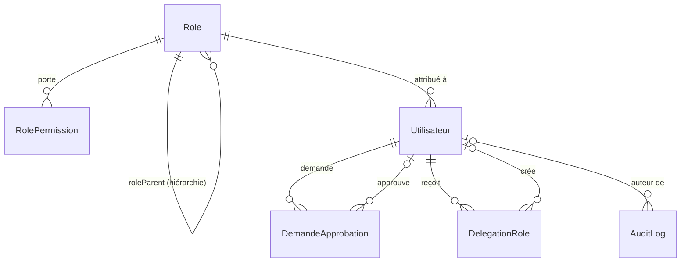
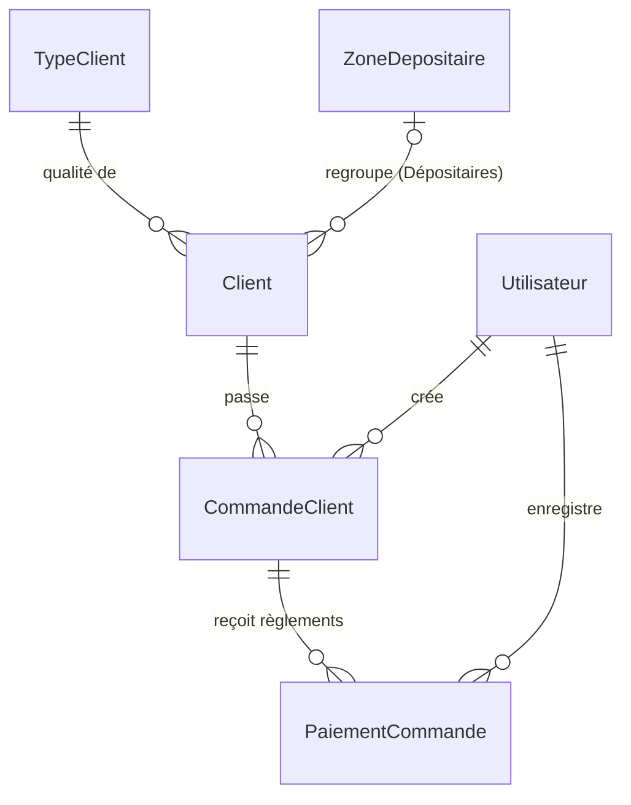
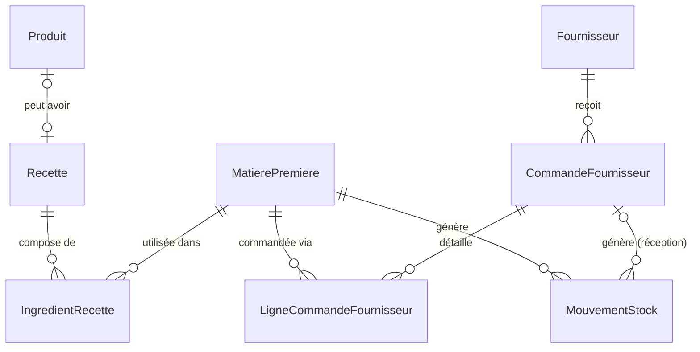
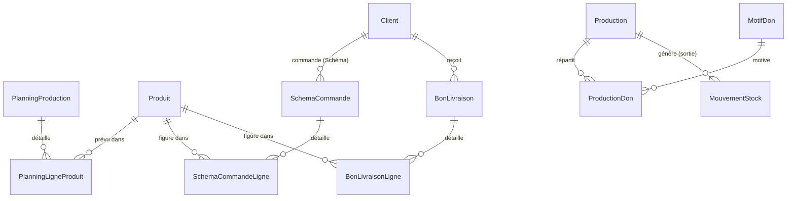
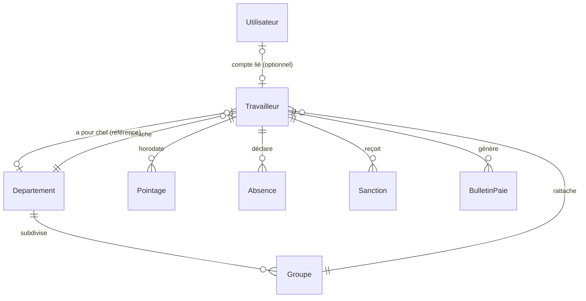
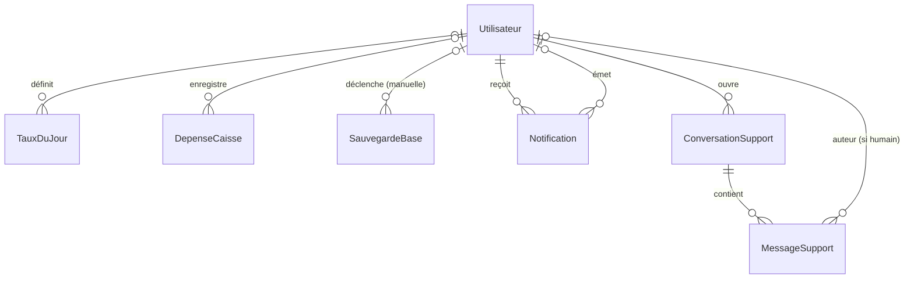

# Volume 13 — Base de données et migrations

**Niveau de risque : 1 — Critique** pour `schema.prisma` (la structure qui porte tout l'argent et toutes les permissions de l'application) ; **Niveau 3** pour `seed.ts` (jeu de données de démonstration). La quasi-totalité des modèles Niveau 1 (commandes, paie, permissions, approbations, délégations, audit, caisse) a déjà été expliquée en détail, champ par champ, dans son chapitre applicatif (Volumes 11a à 11k) — ce chapitre ne les reproduit pas ligne à ligne, il assemble la **vue d'ensemble relationnelle** qui manquait encore : comment tous ces modèles s'articulent entre eux, quelles conventions transversales les relient, et ce que l'historique des 29 migrations révèle sur l'évolution réelle du projet.

> **Mise à jour (correctif P0-01, 19-20/08/2026, complété après revue externe)** : le §5.7 ci-dessous décrit `prisma/seed.ts` comme « autoritatif sur la matrice de permissions » (`upsertRole` supprimant via `deleteMany` toute permission absente de la liste). C'était vrai à la rédaction de ce chapitre, mais c'était précisément le risque de sécurité corrigé par P0-01 : `render.yaml` exécutait ce comportement à **chaque déploiement de production**, pouvant recréer des comptes à mot de passe connu et écraser silencieusement une permission modifiée par un Administrateur réel. Le fichier a été renommé `prisma/seed-demo.ts` (dev/test uniquement, refuse désormais de s'exécuter hors d'un environnement local explicitement reconnu) et son comportement « autoritatif » a été retiré du chemin de production : `prisma/bootstrap-production.ts` (nouveau, `npm run db:bootstrap:production`) n'installe un rôle que s'il est **totalement absent**, ne modifie et ne supprime plus jamais une permission déjà existante. Voir `DEPLOIEMENT.md` § « Correctif P0-01 » pour le comportement actuel faisant foi. Ce chapitre reste un instantané du code tel qu'il existait à sa rédaction et n'est pas réécrit au-delà de cette note.

## Fiche d'identité

| Fichier | Lignes | Rôle |
|---|---:|---|
| `prisma/schema.prisma` | 980 | Source unique de vérité du modèle de données : 42 modèles, 16 énumérations |
| `prisma/migrations/*/migration.sql` | 29 dossiers | Historique chronologique et irréversible des changements de schéma, chacun généré automatiquement par `prisma migrate dev` |
| `prisma/seed.ts` | 343 | Jeu de données de démonstration : rôles, matrice de permissions, comptes, clients, catalogue, stock initial |

- **Qui l'utilise** : absolument tout le code serveur, via `apps/api/src/lib/prisma.ts` (Volume 11g) — le client Prisma généré (`@prisma/client`) est un miroir TypeScript exact de ce schéma, régénéré à chaque modification (`prisma generate`).
- **Ce qu'il ne contient jamais** : aucune logique métier. `schema.prisma` décrit des **formes** (champs, types, relations, contraintes d'intégrité) — les calculs et règles de validation vivent dans `packages/shared` (Volume 11a et suivants) et dans les routes elles-mêmes.

## 5.1 Vue d'ensemble intuitive — trois rôles distincts

Trois fichiers, trois responsabilités qu'il ne faut jamais confondre :

- **`schema.prisma`** décrit l'état **voulu** de la base à l'instant présent — la vérité actuelle, celle que le code TypeScript manipule.
- **Les migrations** (`prisma/migrations/`) forment l'**historique** de la façon dont on est arrivé à cet état : chaque dossier est un pas, horodaté et nommé, jamais réécrit après coup. Modifier `schema.prisma` puis lancer `prisma migrate dev` génère automatiquement le SQL nécessaire pour faire passer une base existante de l'état précédent au nouvel état — Prisma compare les deux schémas et en déduit le `ALTER TABLE`/`CREATE TABLE` à exécuter.
- **`seed.ts`** est un script, pas un composant de schéma : il **remplit** une base déjà migrée avec des données de démonstration cohérentes (rôles, comptes, catalogue) — nécessaire pour démarrer l'application dans un état utilisable, mais entièrement séparé de la structure elle-même.

## 5.2 Conventions transversales — ce qui revient dans presque tous les modèles

Plutôt que de les répéter à chaque ligne du schéma, ce livre a déjà signalé plusieurs de ces conventions au fil des chapitres applicatifs ; les voici rassemblées une fois pour toutes.

### Identifiants : `cuid()`, jamais d'entier auto-incrémenté comme clé primaire

```prisma
id String @id @default(cuid())
```

Tous les modèles de ce schéma, sans exception, utilisent un `cuid()` (*collision-resistant unique identifier*, un identifiant textuel généré côté application, triable chronologiquement et pratiquement impossible à deviner) comme clé primaire — jamais un entier auto-incrémenté classique. **Deux modèles font exception** pour un champ *différent* de l'identifiant : `CommandeClient.numero` et `CommandeFournisseur.numero` (`Int @unique @default(autoincrement())`) — un numéro métier, lisible et séquentiel, affiché à l'écran et parlé à voix haute (« la commande n°12 », Volume 11h), distinct de leur `id` technique qui reste un `cuid()`. Une clé primaire prévisible (1, 2, 3…) exposerait, par simple observation, le volume total d'enregistrements d'une table — un `cuid()` n'en révèle rien.

### `createdAt`/`updatedAt` : présents presque partout, mais pas toujours les deux

```prisma
createdAt DateTime @default(now())
updatedAt DateTime @updatedAt
```

`createdAt` (horodatage de création, fixé une fois pour toutes par `@default(now())`) apparaît sur la quasi-totalité des modèles. `updatedAt` (mis à jour automatiquement par Prisma à chaque écriture, `@updatedAt`) est **volontairement absent** de certains modèles à vocation d'historique immuable — `AuditLog` (Volume 11g), `DemandeApprobation` (Volume 11f), `BulletinPaie` (Volume 11k-3), `SauvegardeBase` (Volume 23) : ces entités ne sont, par construction applicative, **jamais modifiées** après leur création (seuls certains champs de `DemandeApprobation` évoluent une fois, lors de la décision — mais le modèle n'a pas de notion générique de « dernière modification » à afficher). L'absence de `updatedAt` sur ces modèles n'est pas un oubli : c'est une confirmation supplémentaire, au niveau du schéma lui-même, de leur nature figée.

### `onDelete` : trois stratégies, choisies délibérément selon la nature du lien

Ce livre a déjà rencontré les trois comportements possibles quand la ligne référencée par une clé étrangère est supprimée — les revoici en synthèse, avec leur logique générale :

| Stratégie | Effet | Utilisée pour... | Exemple déjà expliqué |
|---|---|---|---|
| `Cascade` | Supprime aussi les lignes qui référencent la ligne effacée | Données **opérationnelles**, subordonnées à leur parent, sans valeur propre une fois celui-ci disparu | `Pointage`/`Absence`/`Sanction` supprimés avec leur `Travailleur` (Volume 11k-1) |
| `SetNull` | Vide la clé étrangère (passe à `null`) plutôt que de supprimer | Références vers l'**auteur** d'une action, quand l'historique de l'action doit survivre à la disparition de son auteur | `AuditLog.utilisateurId`, `DemandeApprobation.approuveParId` (Volumes 11f, 11g) |
| *(absent — comportement par défaut de Prisma)* | Empêche la suppression tant qu'une ligne y fait référence (`Restrict` implicite) | Relations **obligatoires** (non nullables) vers une entité qui ne doit jamais disparaître silencieusement pendant qu'elle est référencée | `CommandeClient.client` (une commande sans client n'a pas de sens) |

Un quatrième filet de sécurité, **au niveau applicatif plutôt que du schéma**, a déjà été rencontré deux fois dans ce livre : `Travailleur → BulletinPaie` est bien déclaré `onDelete: Cascade` (comme les trois autres relations de `Travailleur`), mais la route `DELETE /api/travailleurs/:id` (Volume 11k-1) bloque explicitement la suppression si des bulletins existent, **avant** que ce `Cascade` ne puisse jamais s'exécuter en pratique. Le schéma seul ne suffit donc pas toujours à décrire le comportement réel — une leçon déjà tirée en détail au Volume 11k-1.

### `Int` contre `Decimal` : deux façons de compter, jamais `Float` pour de l'argent

Rappel du Volume 11a, confirmé ici au niveau du schéma : tout montant en Francs congolais est un `Int` (`CommandeClient.montantBrut`, `DepenseCaisse.montant`...) — jamais de centimes, jamais de virgule flottante. Les **quantités physiques fractionnaires** (sacs de farine, litres d'huile, kilogrammes de sel) utilisent en revanche `Decimal @db.Decimal(12, 3)` — un type à précision fixe et exacte, préféré à `Float` précisément pour éviter la dérive d'arrondi qu'un flottant binaire introduirait sur des décrémentations répétées (`MatierePremiere.quantiteStock`, commentaire du schéma : *« le Decimal évite la dérive des flottants sur les décrémentations répétées »*). Une exception notable, déjà détaillée au Volume 11k-3 : `BulletinPaie.tauxJournalier` et `.retenueAbsences` sont des `Float` — le seul endroit du schéma où un flottant binaire porte un montant financier, un choix délibéré et documenté (précision décimale volontairement non figée avant le tout dernier arrondi).

### `DateTime` contre `@db.Date` : deux granularités de date, jamais interchangeables

Une autre convention déjà rencontrée aux volumes 11e, 11j et 11k-3 : un champ `DateTime` classique porte un instant complet (jour, heure, minute, seconde) ; un champ annoté `@db.Date` (`TauxDuJour.date`, `Absence.date`, `Sanction.date`, `DelegationRole.dateDebut`/`dateFin`, `SchemaCommande.date`, `BonLivraison.date`, `PlanningProduction.datePrevue`) est un vrai type SQL `DATE`, sans composante horaire — utilisé partout où la notion de « journée » prime sur l'instant précis (un jour de registre, une journée d'absence, une plage de délégation). `Pointage.horodatageEntree`/`horodatageSortie`, à l'inverse, restent des `DateTime` complets — rappel du Volume 11k-1 : c'est précisément ce choix qui permet à un pointage de gérer nativement une équipe de nuit à cheval sur deux jours calendaires, un cas qu'un simple `@db.Date` ne pourrait pas représenter.

### Instantanés JSON : `Json` pour figer une donnée composite dans le temps

Trois champs du schéma utilisent le type `Json` pour stocker une **copie** de données plutôt qu'une référence relationnelle vivante : `DemandeApprobation.donnees` (le payload d'une action critique à rejouer telle quelle, Volume 11f), `AuditLog.avant`/`apres` (les instantanés avant/après d'une écriture, Volume 11g), et `BulletinPaie.absencesNonJustifiees`/`sanctionsRetenues` (Volume 11k-3). Le point commun aux trois : dans chaque cas, le projet a délibérément choisi de **copier** plutôt que de **référencer**, précisément pour que la donnée stockée reste figée même si les enregistrements source (une `Absence`, une `Sanction`, une `CommandeClient`...) changent ou disparaissent ensuite. C'est le même principe appliqué trois fois à des domaines différents.

### Un index unique partiel — la seule contrainte SQL écrite à la main

```sql
-- migration 20260717114114_retrofit_roles_reglements
CREATE UNIQUE INDEX "Utilisateur_admin_principal_unique" ON "Utilisateur" ("estAdminPrincipal") WHERE "estAdminPrincipal" = true;
```

Déjà mentionné au Volume 11d sans être montré : voici la ligne SQL réelle qui garantit qu'**au plus un seul compte** peut avoir `estAdminPrincipal = true` à la fois. Un **index unique partiel** (`WHERE ...`) est une fonctionnalité native de PostgreSQL qui n'a pas d'équivalent direct dans la syntaxe déclarative de `schema.prisma` (Prisma ne propose pas d'attribut pour exprimer une contrainte d'unicité conditionnelle) — c'est pourquoi cette ligne apparaît directement dans le fichier `migration.sql`, ajoutée manuellement après la génération automatique de la migration, plutôt que déduite du schéma. C'est la **seule** contrainte de ce type dans tout l'historique des migrations : chaque autre contrainte d'unicité du projet (`@unique`, `@@unique([...])`) est une unicité **inconditionnelle**, directement exprimable dans `schema.prisma`.

## 5.3 Vue d'ensemble relationnelle

Le schéma complet (42 modèles) est trop dense pour un diagramme unique lisible — il est présenté ici en six zones, groupées par domaine fonctionnel plutôt que par ordre d'apparition dans le fichier. Les cardinalités suivent la notation Mermaid standard : `||` un exactement, `|o` zéro ou un, `o{` zéro ou plusieurs.

### Identité, permissions et gouvernance



Le cœur du système de permissions (Volumes 11a-11d) : un `Role` porte sa matrice de `RolePermission` (une par `Module`) et peut avoir un rôle parent (hiérarchie utilisée pour l'affichage, pas pour l'hérédité de droits — Volume 11a). `DemandeApprobation` (Volume 11f) et `DelegationRole` (Volume 11e) relient toutes deux un `Utilisateur` à un autre, avec des rôles distincts (demandeur/approbateur, bénéficiaire/créateur). `AuditLog` (Volume 11g) référence son auteur en `SetNull` — seul le nom figé (`utilisateurNom`) survit vraiment à la suppression d'un compte.

### Commandes, clients et commissions



Rien de nouveau ici par rapport aux volumes 11a, 11e (Zones, en réalité rattachées au module Commandes malgré leur nom), 11h et 11i — cette vue confirme simplement, d'un coup d'œil, qu'il n'existe **aucun modèle « Commission »** séparé (Volume 11i) : le module Commissions relit `CommandeClient` au travers de `TypeClient.commissionParBac`, sans jamais écrire sa propre table.

### Catalogue, stocks et fournisseurs



`Recette`/`IngredientRecette` (grisés dans le code par le commentaire *« ORPHELINE »*, §5.4) restent présents dans le schéma mais ne sont plus alimentés — la refonte de la Production (section 3.3) a remplacé la nomenclature par produit par une saisie globale des ingrédients utilisés (Volume 11k, note de contexte). `MouvementStock` (Volume 18, à venir) est le point de convergence entre trois origines possibles : une production (sortie), une réception de commande fournisseur (entrée), ou aucune des deux (mouvement manuel, `productionId`/`commandeFournisseurId` tous deux nuls).

### Production, planning et livraison



Trois modèles à structure quasiment identique (une fiche + ses lignes par produit) : `PlanningLigneProduit`, `SchemaCommandeLigne`, `BonLivraisonLigne` — chacun un `@@unique([..., produitId])`, empêchant deux lignes pour le même produit sur la même fiche. Le lien **automatique** entre `SchemaCommande` et `PlanningProduction` (le commentaire du schéma le précise : les totaux du Schéma de commande alimentent *automatiquement* `PlanningProduction.nombreBacsCommandes`) n'apparaît volontairement **pas** comme une relation Prisma directe — c'est une synchronisation applicative, pas une clé étrangère, un point à vérifier en détail quand ces modules seront traités individuellement (Volume 18).

### Travailleurs et paie



Déjà entièrement expliqué au Volume 11k. Point structurel à noter ici : `Departement.chefTravailleurId` pointe vers un `Travailleur` (pas un `Utilisateur`) — cohérent avec la spec (Volume 11k-1) : un chef de département est *« une simple référence, pas de droits particuliers dans l'app »*, donc rattaché à la fiche de personnel, pas à un compte de connexion.

### Caisse et infrastructure système



`ParametreBoutique` (une simple table clé/valeur, Volume 11f pour son usage lors des tâches critiques) n'a aucune relation vers `Utilisateur` — c'est un magasin de configuration globale, sans notion d'auteur par entrée. `SauvegardeBase` (Volume 23, à venir) n'a un auteur que pour les sauvegardes manuelles (`declencheParId` nul pour les automatiques, cohérent avec le principe déjà vu pour les événements système, Volumes 11h/11k-2).

## 5.4 Modèle par modèle — table de référence complète

Les modèles déjà expliqués en détail dans un chapitre applicatif ne sont ici que résumés, avec renvoi ; les modèles non encore couverts (Niveau 2/3, réservés au Volume 18) sont marqués comme tels.

| Modèle | Rôle en une ligne | Déjà expliqué |
|---|---|:---:|
| `Role`, `RolePermission` | Rôle nommé + sa matrice de permissions par module | Volumes 11a, 11d |
| `Utilisateur` | Compte de connexion, permissions, session unique, statut Admin Principal | Volumes 11b-11d |
| `Notification` | Notification temps réel persistée (rattrapage hors ligne) | Volume 12 (à venir) |
| `TypeClient`, `Client`, `ZoneDepositaire` | Qualité tarifaire, fiche client, regroupement organisationnel des Dépositaires | Volumes 11a, 11h |
| `CommandeClient`, `PaiementCommande` | Commande enregistrée, règlement ultérieur d'une dette | Volume 11h |
| `Produit` | Catalogue des pains vendus | Volume 18 (Niveau 2) |
| `MatierePremiere`, `MouvementStock` | Ingrédient suivi en stock, journal append-only de ses mouvements | Volume 18 (Niveau 2) |
| `Fournisseur`, `CommandeFournisseur`, `LigneCommandeFournisseur` | Fournisseur, bon de commande, ligne détaillée | Volume 18 (Niveau 2) |
| `Recette`, `IngredientRecette` | Nomenclature par produit — **orpheline** depuis la refonte de la Production (§5.3) | Volume 18 (mention historique) |
| `PlanningProduction`, `PlanningLigneProduit` | Prévision de production du lendemain | Volume 18 (Niveau 2) |
| `SchemaCommande`, `SchemaCommandeLigne` | Relevé des commandes par client et par date (Schéma de commande) | Volume 18 (Niveau 2) |
| `BonLivraison`, `BonLivraisonLigne` | Constat de ce qui a réellement été livré | Volume 18 (Niveau 2) |
| `MotifDon`, `Production`, `ProductionDon` | Enregistrement de production et répartition des dons de bacs | Volume 18 (Niveau 2) |
| `Travailleur`, `Departement`, `Groupe` | Fiche de personnel, organisation hiérarchique | Volume 11k-1 |
| `Pointage`, `Absence`, `Sanction` | Horodatage de présence, absence justifiée/non, sanction disciplinaire | Volumes 11k-1, 11k-2 |
| `BulletinPaie` | Instantané figé d'un calcul de paie | Volume 11k-3 |
| `DemandeApprobation` | Tâche critique différée en attente de l'Admin Principal | Volume 11f |
| `DelegationRole` | Droit d'écriture temporaire sur un module | Volume 11e |
| `TauxDuJour`, `DepenseCaisse` | Registre journalier de Caisse | Volume 11j |
| `ParametreBoutique` | Magasin clé/valeur des réglages de la boutique | Volume 18 (Niveau 2) |
| `AuditLog` | Journal d'audit immuable | Volume 11g |
| `SauvegardeBase` | Journal des tentatives de sauvegarde de la base | Volume 23 (à venir) |
| `ConversationSupport`, `MessageSupport` | Messagerie Assistant (support humain/IA) | Volume 18 (Niveau 2) |

## 5.5 Un commentaire obsolète, découvert en reconstituant l'historique des migrations

En préparant ce chapitre, la lecture de l'historique complet des migrations a révélé une incohérence interne au code, distincte d'un écart avec la spécification — elle mérite d'être documentée précisément, y compris parce qu'elle a nécessité une **correction** du Volume 11j, déjà appliquée.

Le schéma actuel porte encore ce commentaire, juste avant le modèle `TauxDuJour` :

```prisma
// --- Caisse : registre journalier (section 3.1) -----------------------------
// Les modèles Vente / LigneVente / ClotureCaisse ci-dessus sont ORPHELINS depuis
// la refonte de 3.1 (vente au comptoir retirée) : conservés en base, plus
// référencés par aucune route ni UI.
```

Or aucun modèle `Vente`, `LigneVente` ni `ClotureCaisse` n'existe dans `schema.prisma` à l'heure actuelle. La reconstitution de l'historique explique pourquoi : la migration `20260806134719_absence_alerte_et_nettoyage_orphelines` les a **réellement supprimées** (avec la table `Presence`, remplacée par `Pointage`/`Absence`), après avoir vérifié — via un bloc `DO $$ ... END $$` explicite dans le SQL — que les quatre tables étaient bien vides avant toute suppression, la migration s'arrêtant entièrement (transaction annulée) si l'une d'elles contenait encore des lignes :

```sql
DO $$
DECLARE n integer;
BEGIN
  SELECT count(*) INTO n FROM "Vente"; IF n > 0 THEN
    RAISE EXCEPTION 'Migration arrêtée : la table Vente contient encore % ligne(s)', n;
  END IF;
  -- ... même vérification pour LigneVente, ClotureCaisse, Presence
END $$;
```

Le commentaire au-dessus de `TauxDuJour`, lui, n'a jamais été mis à jour pour refléter cette suppression ultérieure — il continue de décrire un état (« conservés en base ») qui n'est plus vrai depuis cette migration. **Ce n'est pas un écart entre la spécification et le code** (la spec ne mentionne jamais ces tables historiques par leur nom), mais une incohérence purement interne au code : un commentaire devenu faux avec le temps, sans conséquence fonctionnelle (rien ne le lit ni ne s'y fie à l'exécution), mais qui aurait pu induire en erreur un lecteur humain — ce qui, précisément, s'est produit lors de la rédaction du Volume 11j, corrigée dès cette découverte (voir la note de correction dans ce chapitre). **Recommandation** (à distinguer explicitement d'un constat, conformément aux règles de ce livre) : mettre à jour ou retirer ce commentaire lors d'une prochaine intervention sur ce fichier.

Un second commentaire du même genre, mais **correctement tenu à jour** cette fois, existe dans `apps/api/src/lib/audit.ts` (Volume 11g) : `Presence: "TRAVAILLEURS", // ORPHELINE (remplacée par Pointage/Absence, 3.18)`. Cette entrée reste présente dans `MODELE_MODULE` (un simple `Record<string, string>`, non typé contre les modèles Prisma réels — rien n'oblige à la retirer) mais son commentaire l'annonce déjà comme orpheline ; ce chapitre confirme seulement qu'elle l'est encore plus qu'il n'y paraît, puisque le modèle `Presence` lui-même n'existe plus du tout.

## 5.6 Historique des migrations — résumé chronologique

29 migrations, de `20260715114609_init` à `20260807164017_bon_livraison`, retracent un peu moins d'un mois de développement continu. Plutôt qu'un examen ligne à ligne (hors de portée pour un historique SQL de cette taille, et peu utile — chaque migration correspond à une fonctionnalité déjà expliquée dans son chapitre applicatif), voici les grandes étapes qu'elles révèlent, dans l'ordre :

1. **`init`** — schéma fondateur : rôles, permissions, utilisateurs, catalogue produits, premier jet de la Caisse (avec `Vente`/`LigneVente`/`ClotureCaisse`, plus tard supprimées).
2. **`notifications`**, **`commandes_clients`** — mise en place du système de notifications temps réel et du module Commandes.
3. **`retrofit_roles_reglements`** — ajout du statut Admin Principal et de son index unique partiel (§5.2), ajustement de la matrice de rôles.
4. **`caisse`**, **`stocks_production`**, **`fournisseurs_achats`**, **`travailleurs_presences`** — mise en place successive des modules métier restants (première version du suivi de présence, avant sa refonte ultérieure en Pointage/Absence).
5. **`langue_preferee`** — ajout de la préférence de langue par utilisateur (Volume 17, à venir).
6. **`phase10_approbations_delegations`**, **`phase11_journal_audit`** — les deux mécanismes transversaux de gouvernance (Volumes 11f, 11e, 11g), ajoutés ensemble.
7. **`vente_annulation_dg`** — puis, plus tard dans l'historique, **`refonte_production`** et **`caisse_registre_journalier`** marquent la bascule vers le modèle actuel : retrait de la vente au comptoir, Caisse transformée en registre journalier pur (Volume 11j).
8. **`alerte_dette_non_payee`** — ajout du mécanisme d'alerte paresseuse (Volume 11h), plus tard repris à l'identique pour les absences (`absence_alerte_et_nettoyage_orphelines`).
9. **`sauvegardes_base`**, **`reinitialisation_sauvegarde`** — mise en place de la sauvegarde et de la réinitialisation (Volume 23, à venir).
10. **`ajout_session_unique_utilisateur`** — le mécanisme de session unique (Volume 11b).
11. **`assistant_support_messagerie`**, **`assistant_ia_escalade`** — messagerie Assistant humaine, puis escalade IA (Volume 18/19, à venir).
12. **`travailleur_email_pro`** — intégration Cloudflare Email Routing (Volume 18).
13. **`refonte_travailleurs_departements`**, **`pointage_absence`**, **`absence_declare_par`**, **`salaire_sanctions`**, **`bulletins_paie`**, **`absence_alerte_et_nettoyage_orphelines`** — la reconstruction complète du module Travailleurs en six migrations successives (Volume 11k), culminant avec la suppression effective des tables orphelines (§5.5).
14. **`schema_commande_zones_depositaires`**, **`bon_livraison`** — les deux dernières migrations de l'historique, ajoutant le Schéma de commande, les Zones de dépôt et le Bon de livraison (section 3.3, Volume 18).

Cette chronologie confirme, à l'échelle du schéma tout entier, un constat déjà fait chapitre par chapitre : le projet a évolué par **refontes successives et documentées**, jamais par simple accumulation — chaque changement de direction majeur (retrait de la vente au comptoir, remplacement de `Presence` par `Pointage`/`Absence`) laisse une trace explicite dans l'historique plutôt que de disparaître silencieusement.

## 5.7 `seed.ts` — bootstrap, pas un simple jeu de données

> ⚠️ **Voir la mise à jour en tête de chapitre.** Ce §5.7 décrit le comportement de `prisma/seed.ts` **avant le correctif P0-01** — il n'est plus exécuté en production, et le comportement « autoritatif » décrit ci-dessous n'existe plus dans `prisma/bootstrap-production.ts`, le script qui a repris le chemin de production.

Contrairement à un script de seed typique qui se contenterait de créer des lignes, `prisma/seed.ts` porte une responsabilité supplémentaire, documentée dans ses propres commentaires : il est **autoritatif sur la matrice de permissions**.

```ts
// Le seed est AUTORITATIF sur la matrice : les permissions absentes de la
// liste sont supprimées (permet les retraits, ex. DG sans accès Paramètres).
async function upsertRole(nom: string, roleParentNom: string | null, permissions: PermissionSeed[]) {
  ...
  for (const p of permissions) {
    await prisma.rolePermission.upsert({ where: { roleId_module: { roleId: role.id, module: p.module } }, update: { niveauAcces: p.niveauAcces }, create: { roleId: role.id, module: p.module, niveauAcces: p.niveauAcces } });
  }
  await prisma.rolePermission.deleteMany({ where: { roleId: role.id, module: { notIn: permissions.map((p) => p.module) } } });
  return role;
}
```

`upsertRole` ne se contente pas de créer les permissions listées — il **supprime** également celles qui existeraient en base pour ce rôle mais qui ne figurent plus dans la liste transmise (`deleteMany` avec `notIn`). Concrètement : relancer le seed après avoir retiré un module de la liste des permissions d'un rôle dans le code retire effectivement ce module en base, sans qu'il faille une migration ou une commande manuelle. C'est ce mécanisme qui rend le seed **rejouable** (`upsert` partout, jamais de `create` brut qui échouerait sur une base déjà peuplée) et qui en fait, de fait, un second niveau de définition de la matrice de permissions — le schéma définit la *forme* (`RolePermission`), le seed définit le *contenu de référence*.

Trois fonctions de **retrofit** (`fusionnerRolesStockAchats`, `retirerRoleChargeDuPersonnel`, `migrerEmailsDemoVersNouveauDomaine`) illustrent une pratique qui traverse tout l'historique : plutôt que d'écrire une migration SQL ponctuelle pour ces changements de données (fusion de rôles, suppression d'un rôle, renommage de domaine e-mail), le projet les a codés comme des étapes **idempotentes** du seed lui-même — chacune vérifie explicitement si son travail a déjà été fait (`if (anciens.length === 0) return;`) avant d'agir, donc sans risque à être rejouée indéfiniment. Le reste du fichier crée le catalogue de démonstration (3 Qualités, 8 comptes correspondant chacun à un rôle, 5 clients, 4 produits, 6 matières premières, 2 motifs de don, 2 fournisseurs) avec un mot de passe de démonstration commun (`Lomoto2026!`, jamais utilisé en production — Volume 5, Configuration, pour la gestion réelle des identifiants).

## 5.8 Cas limites et points de vigilance

| Situation | Comportement |
|---|---|
| Deux comptes tentant simultanément de devenir Admin Principal | Bloqué au niveau base par l'index unique partiel (§5.2) — pas seulement par la logique applicative déjà vue au Volume 11d. |
| Relancer `seed.ts` sur une base déjà peuplée | Sûr — chaque opération est un `upsert` ou une fonction de retrofit idempotente (§5.7). |
| Retirer un module de la liste de permissions d'un rôle dans `seed.ts`, puis relancer le seed | Le module est effectivement retiré en base pour ce rôle (`deleteMany` avec `notIn`, §5.7). |
| Consulter les tables `Vente`/`LigneVente`/`ClotureCaisse`/`Presence` aujourd'hui | N'existent plus — supprimées par la migration `absence_alerte_et_nettoyage_orphelines` (§5.5), malgré un commentaire du schéma encore non mis à jour. |
| `Recette`/`IngredientRecette` | Modèles toujours présents en base (non supprimés, à la différence des quatre ci-dessus), mais plus alimentés par aucune route depuis la refonte de la Production. |

## 5.9 Croisement avec la spécification

Ce chapitre porte sur la structure du schéma, pas directement sur une section unique de la spécification — chaque modèle a déjà été croisé avec sa section correspondante dans son propre chapitre applicatif (Volumes 11a-11k), sans écart trouvé. Le seul point relevé ici (§5.5) est une incohérence interne au code (un commentaire obsolète), explicitement distinguée d'un écart spec/code — elle n'entre donc pas dans `annexes/ecarts-spec-code.md`, réservé aux divergences entre l'intention de la spécification et le comportement réel de l'application.

## 5.10 Résumé

Avec ce chapitre, **`schema.prisma` étant lui-même classé Niveau 1** (`INVENTAIRE_DU_PROJET.md`), le Niveau 1 est désormais **réellement clos à 26/26 (100 %)** — le Volume 11k avait initialement (et à tort) annoncé cette clôture un fichier trop tôt, une erreur corrigée rétroactivement dans ce même volume et dans `ETAT_DE_PROGRESSION.md`.

Ce chapitre n'a pas eu à redécouvrir les règles métier — elles avaient déjà été exposées, formule par formule, aux volumes précédents. Sa valeur propre est ailleurs : les conventions transversales (identifiants, `onDelete`, `Int` contre `Decimal`, `DateTime` contre `@db.Date`, instantanés JSON) qui, une fois vues une fois pour toutes ici, éclairent rétrospectivement des dizaines de détails déjà rencontrés chapitre par chapitre ; la vue relationnelle complète, qui montre comment 42 modèles s'articulent réellement entre eux ; et une reconstitution de l'historique des migrations qui a révélé, au passage, un commentaire obsolète dans le code — corrigé dans le chapitre qu'il avait involontairement induit en erreur (Volume 11j).

---

**Suite →** Reprise du parcours Niveau 2/3 dans l'ordre du mandat : Volumes 4 (Installation) et 5 (Configuration), en s'appuyant sur `README.md`, `.env.example` et `render.yaml`.
