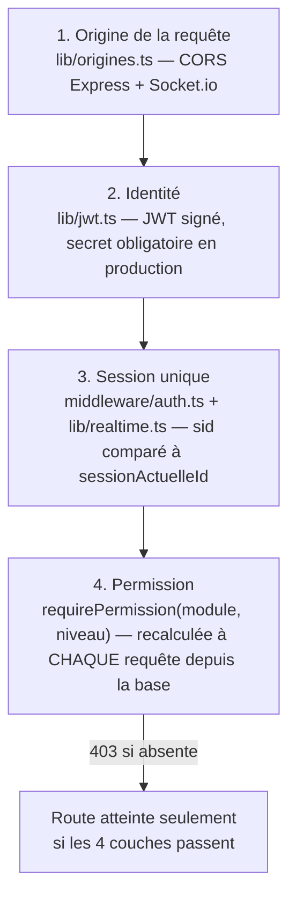

# Volume 14 — Authentification, autorisations et sécurité (synthèse transversale)

**Niveau de risque : 2 — Fonctionnel standard (synthèse).** Comme le Volume 6, ce chapitre ne repose que sur un seul fichier encore inédit (`lib/origines.ts`) — le reste consolide, sous un seul angle « sécurité », des mécanismes déjà expliqués en détail et en contexte dans les Volumes 11b, 11c, 11d, 11z-5 et 12. L'objectif : donner au lecteur une vue d'ensemble des défenses du projet, sans le renvoyer fouiller dix chapitres différents.

## 1. Ce que couvre ce chapitre

- `apps/api/src/lib/origines.ts` (nouveau — CORS, domaine canonique)
- Synthèse : `lib/jwt.ts` et `middleware/auth.ts` (Volume 11b), `routes/auth.ts` (Volume 11c), `lib/realtime.ts` (Volume 12)
- Le constat de l'audit de sécurité déjà réalisé dans ce dépôt — présenté comme fait acquis, pas comme audit à refaire

## 2. Les quatre couches de défense, en une vue

Aucune de ces couches ne remplace les autres : l'origine autorisée n'authentifie personne, un jeton valide ne garantit pas une session encore active, une session active ne donne aucune permission de module. Les quatre sont vérifiées **indépendamment**, à chaque requête HTTP comme à chaque connexion Socket.io.

## 3. Couche 1 — `lib/origines.ts` (nouveau dans ce chapitre)

Fichier de 50 lignes, source **unique** partagée par `app.ts` (CORS Express, Volume 8) et `lib/realtime.ts` (CORS Socket.io, Volume 12) — le commentaire du code identifie explicitement le piège qu'il évite : Express et Socket.io ont chacun leur propre configuration CORS, et une mise à jour de l'une sans l'autre est une source d'erreur classique. `verifierOrigine` est un unique callback, au format attendu par les deux bibliothèques, jamais dupliqué.

Deux nuances déjà pressenties mais jamais expliquées jusqu'ici :

- **Le CORS n'est pas une condition de fonctionnement, mais un durcissement.** L'application fonctionne en same-origin (le frontend appelle l'API en chemins relatifs) — CORS n'est donc jamais ce qui ferait échouer une visite normale. Sa liste (`ORIGINES_AUTORISEES`) empêche seulement un site tiers d'appeler directement l'API depuis un navigateur.
- **Domaine canonique = `www`, pas l'apex** — contre-intuitif, mais documenté dans le code comme une conséquence d'un choix déjà fait côté Render (qui redirige l'apex vers `www` à son edge, avant même que l'application ne reçoive la requête). Un premier essai en sens inverse a provoqué une **boucle de redirection infinie** (Render renvoie apex→www, l'application renvoyait www→apex) — sans accès au tableau de bord Render pour changer ce réglage, la seule sortie de boucle documentée est de suivre le choix de l'hébergeur plutôt que de le contredire. Un exemple concret de contrainte d'infrastructure externe ayant dicté un choix de code, à retenir pour quiconque modifierait ce fichier sans connaître cet historique.

Hors production (`NODE_ENV !== "production"`), la validation reste permissive — le trafic de développement passe de toute façon par le proxy Vite (same-origin), rendant cette branche rarement sollicitée en pratique.

## 4. Couche 2 — Identité (`lib/jwt.ts`, rappel du Volume 11b)

Un jeton signé (bibliothèque `jsonwebtoken`), expiration fixe de **12 heures** (`EXPIRATION = "12h"`), secret obligatoire en production — le serveur refuse de démarrer si `JWT_SECRET` est absent en production (`throw` dans `jwt.ts`, garde-fou déjà croisé avec `render.yaml`/`generateValue` au Volume 5). En développement, un secret par défaut explicite (`"dev-secret-lomoto-change-me-in-production"`) rend la faiblesse visible plutôt que silencieuse. Le payload transporte `sub` (identifiant utilisateur) et `sid` (identifiant de session) — jamais les permissions elles-mêmes, qui sont **toujours recalculées depuis la base** à chaque requête (voir couche 4), jamais fait confiance au contenu du jeton pour cette décision.

## 5. Couche 3 — Session unique (rappel des Volumes 11b, 11c, 12)

Un compte ne peut avoir qu'une seule session active à la fois (`Utilisateur.sessionActuelleId`) : une nouvelle connexion invalide silencieusement toutes les précédentes en base, et le serveur pousse activement l'information aux anciennes sessions plutôt que de les laisser expirer sans le savoir. Ce mécanisme est vérifié à **trois points d'entrée distincts**, chacun avec sa propre implémentation mais la même règle :

| Point d'entrée | Où | Comportement en cas de session périmée |
|---|---|---|
| Chaque requête HTTP | `middleware/auth.ts`, `requireAuth` (Volume 11b) | `401`, message explicite |
| Handshake Socket.io | `lib/realtime.ts`, `io.use(...)` (Volume 12) | Connexion rejetée (`connect_error`) |
| Socket déjà ouvert au moment du remplacement | `invaliderSessionUtilisateur` (Volume 12) | Événement `sessionInvalidee` puis déconnexion forcée |

Le troisième point est celui qui distingue ce projet d'une simple expiration de jeton : un appareil resté connecté est **activement prévenu en temps réel**, pas laissé à découvrir la déconnexion à sa prochaine action.

## 6. Couche 4 — Permission de module (rappel des Volumes 11a, 11b, 11d)

`requirePermission(module, niveau)` est une **fabrique de middleware** (Volume 11b) : elle reçoit un module et un niveau d'accès requis, et renvoie la fonction qui vérifiera précisément ce couple. La règle centrale, `aAcces` (fonction pure de `packages/shared`, Volume 11a), fusionne trois sources à chaque appel : les permissions du rôle de base, les délégations temporaires actives à la date du jour (Volume 11e), et — pour l'Admin Principal — une élévation systématique à l'écriture sur tous les modules (Volume 11d). **Rien de tout cela n'est mis en cache côté serveur entre deux requêtes** : une permission retirée à un rôle prend effet à la requête suivante, sans délai de propagation ni déconnexion nécessaire.

Côté client, les gardes `RequiertLecture`/`RequiertEcriture` (Volume 10) et le grisage des entrées de menu (Volume 9) répliquent la même logique **uniquement pour le confort d'affichage** — jamais comme mécanisme de sécurité. C'est la nuance répétée le plus souvent dans ce livre depuis le Volume 10, et elle mérite d'être redite ici une dernière fois : masquer un bouton ne protège rien, seule la vérification serveur protège.

## 7. Failles déjà trouvées et corrigées — fait acquis, pas audit à refaire

Deux incidents de sécurité réels ont déjà été identifiés et corrigés dans l'historique de ce projet, chacun documenté en détail dans son chapitre d'origine :

1. **Élévation de privilège sur `POST /equipe/:id/principal`** (Volume 11d) : une version antérieure de la route de désignation de l'Admin Principal permettait, dans certaines conditions, à un compte non habilité d'obtenir ce statut. Corrigée ; le chapitre 11d documente l'historique complet du problème et du correctif, vérifié dans le code actuel.
2. **XSS via un lien de réseau social non validé sur `APropos.tsx`** (Volume 11z-5) : un lien enregistré avant le durcissement du schéma Zod serveur pouvait porter un schéma `javascript:` exécutable au clic, sur une page accessible à **tous** les rôles. Corrigée par une double défense — validation serveur (`aProposEditSchema`) **et** filtrage client (`estLienHttpSur`) avant tout rendu en `<a href>`.

Les deux corrections sont **déjà en place dans le code actuel** — ce chapitre ne les redécouvre pas, il les recense comme faits acquis, cohérent avec la mission de ce livre (documenter l'état réel du code, pas mener un nouvel audit).

## 8. Ce qui n'est PAS un mécanisme de sécurité (précisions déjà semées, réunies ici)

- Le grisage des menus et les gardes de route côté client (§6).
- Le champ `roleId` du JWT — jamais utilisé pour construire une permission, ni côté HTTP ni côté Socket.io (vérifié aux Volumes 11b et 12).
- La validation Zod côté client, réutilisée pour l'expérience utilisateur — la validation qui compte est **toujours** celle rejouée côté serveur (approfondi au Volume 15).

## 9. Croisement avec `docs/spec-boulangerie.md`

Aucune section dédiée à la sécurité en tant que telle dans la spécification — les exigences de sécurité y sont dispersées dans les sections fonctionnelles concernées (section 2, hiérarchie et permissions ; 3.7, session unique et délégations), chacune déjà vérifiée dans son chapitre d'origine. Rien de nouveau à confronter ici au-delà de `lib/origines.ts`, qui ne correspond à aucune exigence explicite de la spec (choix d'implémentation pur). Aucun écart.

## 10. Résumé

La sécurité de ce projet ne repose pas sur un composant unique mais sur quatre vérifications indépendantes appliquées à chaque requête, sans exception ni raccourci de performance : origine (durcissement, pas condition de fonctionnement), identité (jeton signé à expiration courte), session unique (poussée activement, pas seulement expirée), et permission (recalculée en base à chaque appel, jamais mise en cache serveur). Les deux failles réelles déjà trouvées dans l'historique du projet ont chacune été corrigées avec une défense en profondeur — jamais un correctif unique côté client ou serveur seul.

---

**Suite →** Volume 15 — Validation des données (Zod), qui détaille le mécanisme déjà mentionné à chaque chapitre applicatif : pourquoi chaque schéma existe en un seul exemplaire partagé, et pourquoi la validation qui compte est toujours celle du serveur.
