# Bibliothèque de composants Premium — apps/web

> Produit dans le cadre de la tâche **F1** du plan de coordination Codex/Claude Code
> (`docs/coordination/PLAN_COORDINATION_CODEX_CLAUDE_LOMOTO.md`, version 2.0).
> Base : `main-a7fm5x` au commit `f7880b90ed1e2b735189b5c06ad9c2d88ed7fe35`.
> Branche : `claude/premium-ui-f1`.

## Périmètre de cette livraison

F1 livre la **bibliothèque de composants** elle-même — aucune page existante
n'a été modifiée, aucun écran ne consomme encore ces composants. C'est
volontaire : le plan de coordination (§6, tâche F1) réserve l'intégration
visuelle (scène de connexion, mot de passe oublié, horloge, anniversaires)
aux vagues suivantes F2/F3, et limite explicitement la zone de fichiers de
F1 à `apps/web/src/components/**`, `apps/web/src/index.css`, `docs/ui/**`,
et `apps/web/src/lib/socket.tsx` — cette dernière uniquement pour le
rollback des notifications.

Aucune route API, migration, contrat partagé (`packages/shared`) ni
dépendance n'a été touchée.

## Composants livrés

| Composant | Fichier | Tâche F1 |
|---|---|---|
| Toast Premium (variantes succès/erreur/avertissement/information) | `components/FeedbackProvider.tsx` (évolution) + `components/toast/toastBus.ts` | 1 |
| Bouton Premium (état `loading`, tailles tactiles `touch`/`icon-touch`) | `components/ui/button.tsx` (évolution additive) | 2 |
| Champ de mot de passe Premium | `components/ui/password-field.tsx` + `components/ui/robustesseMotDePasse.ts` | 3 |
| Zone de texte auto-ajustable | `components/ui/auto-textarea.tsx` + `components/ui/compteurCaracteres.ts` | 4 |
| Sélecteur date/heure en français | `components/ui/date-time-picker.tsx` + `components/ui/dateHeureFr.ts` | 5 |
| Liste mobile + Tableau ordinateur Premium (générique) | `components/premium/premium-table.tsx` + `components/premium/rechercheEtTri.ts` | 6, 7 |
| Pagination Premium générique | `components/ui/pagination.tsx` + `components/ui/pagination-logique.ts` | 8 |
| États vide / chargement / hors-ligne / réessayer | `components/ui/etats.tsx` | 9 |
| Rollback de lecture des notifications + toast d'échec | `lib/socket.tsx` (seule modification autorisée à ce fichier) + `lib/notificationsRollback.ts` | 10 |

Toutes les nouvelles chaînes visibles sont traduites en français, anglais,
lingala et kiswahili (`i18n/{fr,en,ln,sw}.json`, namespace `premium`) — les
**26 nouvelles clés `premium.*`** sont en parité parfaite dans les 4 langues
(vérifié par script). Précision (correction revue Codex sur la formulation
initiale) : le compte *total* de clés par fichier diffère d'une unité selon
la langue — 1039 en FR/EN, 1040 en LN/SW — uniquement à cause de la clé
`_note` (préexistante, propre à ln.json/sw.json, documentant que ces deux
traductions sont un premier jet non définitif — voir Volume 17 du livre
technique). Cette clé de métadonnées n'est pas une chaîne visible et n'entre
pas dans les 26 clés `premium.*` elles-mêmes, dont la parité est totale.

## Corrections apportées suite à la revue Codex (13 août, 2ᵉ commit)

F1 n'était pas validée en l'état : sept points de correction ont été
transmis, tous traités dans cette même branche, avant nouvelle revue.

1. **Rollback ciblé (`lib/socket.tsx` + `lib/notificationsRollback.ts`,
   nouveau)** — l'ancienne version capturait l'état des notifications dans
   un setter React pour le rejouer tel quel après l'appel réseau : un
   rollback qui remplaçait le tableau entier, effaçant au passage toute
   notification arrivée entre-temps via Socket.io. Remplacé par un rollback
   qui ne touche que l'identifiant concerné (jamais un remplacement complet)
   et par un registre de propriété par identifiant (jeton `Symbol` par
   appel) : une requête échouée ne peut plus annuler une mutation plus
   récente ou déjà réussie sur le même identifiant, y compris entre
   `marquerLue` et `toutMarquerLu` concurrents.
2. **`AutoTextarea`** — le compteur de caractères ne suivait `value` qu'au
   premier rendu (pas de resynchronisation si le parent la changeait sans
   passer par `onChange`) ; corrigé par un effet dédié. Le `style`
   personnalisé de l'appelant était entièrement écrasé par `{ maxHeight }`
   (l'ordre des props JSX donnait la main au spread qui suivait) ; corrigé
   par une fusion explicite avec `maxHeight` appliqué en dernier.
3. **`PremiumTable`** — la page affichée ne se recalculait que sur
   changement de recherche/tri, jamais sur une simple baisse du nombre de
   données ou de `taillePage`, pouvant afficher une page vide avec des
   résultats disponibles. Remplacé par une page effective **dérivée**
   (`bornerPage()`, testée), recalculée à chaque rendu sans effet
   supplémentaire ni clignotement.
4. **Système de toasts** — l'ancien plafonnement gardait les 3 *derniers*
   toasts arrivés et perdait silencieusement les précédents, y compris
   persistants. Remplacé par une vraie file d'attente : `toasts` est
   désormais la liste complète, jamais tronquée à l'émission ; seuls les 3
   premiers de la file sont rendus, les suivants prennent le relais dès
   qu'une place se libère. Refonte visuelle : position haut-droite
   (ordinateur) / haut-centré (mobile) au lieu de bas-droite partout, halo
   dégradé derrière un badge d'icône circulaire plus affirmé, cible de
   fermeture 44×44 px.
5. **Accessibilité/cibles tactiles** — `DateHeurePicker` utilise désormais
   `React.useId()` en repli quand `id` n'est pas fourni (l'association
   `Label`/champ était rompue sans lui). Bouton afficher/masquer du mot de
   passe et sélecteur de taille de page portés à 44×44/44 px réels (pas
   seulement visuels). Cases à cocher de `PremiumTable` : un `<span>` avec
   du padding agrandit visuellement la zone mais ne transmet pas le clic à
   la case — remplacé par un vrai `<label>` englobant, qui délègue
   nativement le clic sur toute sa surface.
6. **Tests** — 23 tests supplémentaires (`notificationsRollback.test.ts`,
   nouveau ; `pagination-logique.test.ts` et `toastBus.test.ts` étendus)
   couvrant le rollback ciblé et les scénarios de concurrence simulés, la
   file d'attente de toasts (persistant jamais évincé), et le bornage de
   pagination. Toujours aucune dépendance installée.
7. **Documentation** — précision sur le compte de clés i18n (voir plus bas).

## Pourquoi un « bus de toasts » séparé du contexte React

`FeedbackProvider` est monté **sous** `SocketProvider` dans `main.tsx` :

```
<SocketProvider>
  <FeedbackProvider>
    <App />
  </FeedbackProvider>
</SocketProvider>
```

`useFeedback()` est donc structurellement inaccessible depuis
`lib/socket.tsx`, alors que la tâche F1 demande explicitement de signaler
l'échec du rollback des notifications « via le toast ». Réordonner les
providers aurait nécessité de modifier `main.tsx`, hors zone de fichiers
autorisée pour F1.

Solution retenue : `components/toast/toastBus.ts` est un petit module
d'état **hors contexte React** (le même principe que les bibliothèques de
toast usuelles) — n'importe quel code, dans l'arbre React ou non, peut
appeler `emettreToast(...)` ; `FeedbackProvider` s'y abonne et affiche.
`toastErreur()` (36 appels existants) reste inchangé et rétrocompatible.

## Pourquoi la logique pure est séparée des composants `.tsx`

Chaque composant qui contient une règle de calcul (robustesse d'un mot de
passe, formatage de date, calcul de pagination, recherche/tri, compteur de
caractères) l'expose dans un fichier `.ts` **sans import via l'alias `@/`**,
consommé ensuite par le composant `.tsx` correspondant via un import
relatif. Raison : le `vitest.config.ts` racine (qui exécute `npm test` sur
tout le monorepo, `apps/**/*.test.ts` inclus) n'a pas la résolution d'alias
`@/` → `apps/web/src` configurée — elle n'existe que dans
`apps/web/vite.config.ts`, propre au serveur de dev/au build. Un fichier de
test import la logique pure directement (`./robustesseMotDePasse`, jamais
`@/components/ui/password-field`) et s'exécute donc sans dépendre de cette
résolution.

## Limite connue et demande transmise à Codex

Aucune bibliothèque de rendu de composant (`@testing-library/react`) ni
d'environnement DOM pour Vitest (`jsdom`) n'est installée dans le dépôt —
vérifié avant d'écrire le moindre test :

```
$ find . -iname jsdom -o -iname "*testing-library*"   → aucun résultat
```

Conformément à la règle du plan de coordination (§4 : « Si une bibliothèque
frontend paraît nécessaire, Claude doit d'abord démontrer que les
dépendances présentes ne suffisent pas et transmettre la demande »), F1
n'installe **aucune** dépendance — ni `package.json`, ni `package-lock.json`,
ni aucune configuration de dépendances n'est modifiée. Les 92 tests livrés
(8 fichiers) couvrent donc uniquement la **logique pure** de chaque
composant — calculs, formatage, validation, rollback ciblé, file d'attente
de toasts, bornage de pagination — jamais le rendu DOM (clic, focus, rendu
conditionnel réel).

**Demande approuvée côté Codex** (revue du 13 août) : `jsdom`,
`@testing-library/react`, `@testing-library/user-event` et
`@testing-library/jest-dom` seront ajoutés en `devDependencies` de
`apps/web` par Codex, dans un harnais publié séparément (zone de
dépendances hors périmètre F1). Une fois ce harnais disponible, les tests
DOM suivants restent à ajouter : rollback et concurrence (montage réel de
`SocketProvider`), toasts persistants/timers/pause/fermeture, navigation
clavier/focus, `AutoTextarea` en usage contrôlé, association label/champ,
tailles et états réels des contrôles, pagination après réduction des
données.

## Vérifications exécutées

```
npm test                         → 92/92 tests passants (8 fichiers, 81 nouveaux)
cd apps/web && npm run build     → tsc --noEmit + vite build : succès, aucune erreur
```

Le build inclut la totalité de l'application existante (toutes les pages) :
aucune régression de compilation introduite par cette évolution.

## Accessibilité

- Cibles tactiles réellement ≥ 44×44 px sur tous les contrôles interactifs
  neufs (`size="touch"`/`"icon-touch"` du bouton, boutons de pagination et
  son sélecteur de taille, bouton afficher/masquer du mot de passe centré
  sur le champ, cases à cocher de `PremiumTable` via un vrai `<label>`
  englobant — pas une zone agrandie seulement visuellement).
- Association label/champ : `DateHeurePicker` génère un identifiant stable
  via `React.useId()` quand l'appelant n'en fournit pas, pour ne jamais
  perdre l'association `Label`/champ.
- Navigation clavier : tri des colonnes de `PremiumTable` via un vrai
  `<button>` (pas un simple `onClick` sur `<th>`), focus visible partout
  (`focus-visible:ring-2`).
- `prefers-reduced-motion` respecté (spinner du bouton, barre de durée du
  toast) via la variante Tailwind `motion-reduce:`.
- Toast : `role="alert"`/`"status"` selon la variante, `aria-live` cohérent,
  pause automatique au survol **et** au focus clavier (pas seulement à la
  souris).
- Contraste : nouvelles couleurs d'état (`--succes`, `--avertissement`,
  `--information`) définies en clair et sombre dans `index.css`, sur le
  même modèle que les tokens de marque existants.

## Ce qui reste hors périmètre F1 (volontairement)

Conformément au plan de coordination §6 : pas de scène de connexion à
lampe, pas de parcours mot de passe oublié, pas d'horloge « flip », pas de
« Constellation Lomoto » — ces éléments appartiennent à F2/F3, une fois les
API d'authentification de Codex (C3) disponibles.

---

# F2 — Connexion et enveloppe Premium

> Base : `agent/integration-wave-1` au commit `04b87de1fb3ada819d0a0806117d523d5d327b17`
> (intègre F1 + ses tests DOM, PR #5 fusionnée).
> Branche : `claude/premium-shell-f2`.

## Architecture

- **`components/auth/AuthShell.tsx`** — enveloppe commune aux trois écrans
  d'authentification (connexion, mot de passe oublié, nouveau mot de passe).
  Principe non négociable, documenté en tête du fichier : le formulaire
  (`children`) reste **toujours** pleinement opaque, lisible et utilisable —
  jamais assombri, jamais `pointer-events: none`, jamais retiré de l'ordre
  de tabulation. La lampe à ficelle ne pilote qu'un halo décoratif autour de
  la scène de marque ; la « révélation progressive » du formulaire (tâche 4)
  est une simple animation d'entrée au montage (fondu + léger mouvement),
  indépendante de l'état de la lampe.
- **`components/auth/LampeFicelle.tsx`** + **`lampeLogique.ts`** — lampe
  décorative et interactive. Un vrai `<button>` porte toute la zone
  cliquable (clavier natif, Entrée/Espace), cible tactile réelle ≥ 44×44 px
  (`min-h-11 min-w-11`, revue Codex round 2 : l'icône seule ne faisait que
  36 px). Le clic bascule l'état ; un glissement (souris ou tactile, unifié
  via les Pointer Events) vers le bas au-delà d'un seuil de 32 px bascule
  l'état de la même façon, sans déclencher un second basculement au `click`
  de fin de geste (`aBasculeParGlissement`). La logique de seuil est pure et
  testée sans dépendre du DOM. Propriété du geste par pointeur (revue Codex
  round 2) : seul un pointeur primaire au bouton principal peut démarrer un
  geste (jamais un clic droit, filet de sécurité aussi au niveau du `click`),
  `pointerIdActif` mémorise le pointeur propriétaire — tout événement d'un
  pointeur étranger ou secondaire est ignoré tant que ce geste est en cours.
  `pointercancel` nettoie l'état ET remet à zéro le drapeau anti-double-clic
  (`aBasculeParGlissement`), puisqu'aucun `click` de synthèse ne suit jamais
  un `pointercancel` — sans ce nettoyage, la prochaine activation clavier ou
  le prochain clic normal serait silencieusement avalé.
- **`components/auth/prefersReducedMotion.ts`** — hook `matchMedia` en
  direct (même modèle que `lib/theme.tsx`), utilisé pour : suspendre les
  classes d'animation CSS (`.lomoto-authshell-*`, `index.css`, même
  convention que `.lomoto-splash-*` d'`EcranDemarrage.tsx`) et démarrer la
  lampe déjà « allumée » quand la préférence système la demande — la
  variante réduite est donc observable, pas seulement l'absence de mouvement.
- **`components/HorlogeFlip.tsx`** + **`horlogeLogique.ts`** — horloge
  compacte de l'en-tête (`Layout.tsx`, barre desktop et en-tête mobile).
  Composant isolé : son propre `setInterval`, nettoyé au démontage — seul ce
  composant se re-rend chaque seconde, jamais le reste de l'arbre. Toujours
  affichée en Africa/Kinshasa (`Intl.DateTimeFormat` avec `timeZone` fixe),
  indépendamment du fuseau du navigateur. Sémantique `<time role="timer"
  aria-live="off" dateTime="hh:mm:ss">` (revue Codex round 2, remplace un
  ancien `role="status"`) : une région `status`/`aria-live` par défaut
  annoncerait le changement de libellé à chaque seconde et interromprait en
  continu les lecteurs d'écran ; `timer` + `aria-live="off"` rend l'heure
  consultable à la demande sans jamais l'annoncer automatiquement. Le libellé
  accessible (`auth.clock.ariaLabel`) est réellement localisé dans les 4
  langues : heures/minutes/secondes sont passées séparément à i18next,
  chaque langue compose sa propre phrase (plus de fragment français
  « h/min/s » codé en dur pour EN/LN/SW).
- **`pages/MotDePasseOublie.tsx`** / **`pages/NouveauMotDePasse.tsx`** —
  voir « Comportement provisoire » ci-dessous.
- **`components/Layout.tsx`** — la logique de navigation basée sur les rôles
  (`calculerLiens`), auparavant dupliquée entre la barre latérale desktop et
  le tiroir mobile, est désormais une seule fonction exportée et testée. La
  politique de visibilité existante (spec section 2 : tous les modules
  visibles, grisés hors périmètre du rôle) est **inchangée** — seule la
  duplication de code a été supprimée.

## Comportement provisoire des pages de récupération (tâches 9-10)

Aucun appel réseau n'est jamais effectué par `MotDePasseOublie.tsx` ni
`NouveauMotDePasse.tsx` : pas de faux jeton, pas de fausse demande envoyée,
pas de message laissant croire à un succès. Une soumission valide (après
validation locale uniquement) affiche un message persistant explicite
(`role="status"`) indiquant que l'intégration serveur est en attente — et
UNE SEULE annonce accessible (revue Codex round 2 : le toast de même teneur
a été retiré, il faisait doublon avec le message persistant et aurait
annoncé deux fois la même information aux lecteurs d'écran ; le message
persistant est conservé seul car cette information ne doit jamais
s'effacer automatiquement, contrairement à un toast). Ce choix est requis
par le plan de coordination (§7) : *« La PR F2 peut rester en brouillon tant
que les API d'authentification nécessaires ne sont pas fusionnées »* — ces
écrans attendent les endpoints Codex C3 (réinitialisation par jeton, anti-
énumération, limitation de fréquence).

## i18n

Nouveau namespace `auth.*` (lampe, lien « mot de passe oublié », pages de
récupération, libellé accessible de l'horloge) ajouté aux 4 langues
(FR/EN/LN/SW), parité vérifiée par script (0 clé manquante ou en trop).

## Tests ajoutés

| Fichier | Couvre |
|---|---|
| `auth/lampeLogique.test.ts` | Seuil de glissement (logique pure) |
| `horlogeLogique.test.ts` | Décomposition Kinshasa, passage de minuit, valeur `dateTime` (hh:mm:ss) |
| `auth/LampeFicelle.dom.test.tsx` | Clavier (bouton natif), cible tactile ≥ 44×44 px, clic, glissement Pointer Events au-dessus/en-dessous du seuil, non-double-basculement, pointeur étranger, pointeur secondaire, clic droit, `pointercancel` puis activation clavier/clic normal |
| `auth/AuthShell.dom.test.tsx` | Formulaire toujours utilisable quel que soit l'état de la lampe, variante `prefers-reduced-motion`, filigrane décoratif, lampe desktop + mobile |
| `HorlogeFlip.dom.test.tsx` | `role="timer"`/`aria-live="off"` (jamais `role="status"`), affichage initial, progression par seconde (libellé + `dateTime`), nettoyage exact de l'intervalle au démontage, libellé localisé FR/EN/LN/SW |
| `pages/Login.dom.test.tsx` | Lien « mot de passe oublié », focus clavier, soumission, erreur accessible |
| `pages/MotDePasseOublie.dom.test.tsx` | Association label/champ, validation, **absence d'appel réseau**, absence de message de succès, **une seule** annonce accessible (pas de double toast/message persistant) |
| `pages/NouveauMotDePasse.dom.test.tsx` | Idem + validation longueur/correspondance des mots de passe |
| `Layout.navigation.test.ts` | `calculerLiens` sur plusieurs combinaisons de permissions (lecture, écriture, sans module) |

Résultat : `npm test` → 249/249 tests passants (29 fichiers, +7 tests round 2
Codex). `npm run build` (tsc + vite) et `npm audit` (0 vulnérabilité)
passent également. `npm ci` exécuté avec succès avant la vérification
finale.

## Corrections revue Codex round 2

Six points obligatoires corrigés sur un seul commit, sans régression :

1. **Horloge non bavarde** — `HorlogeFlip.tsx` : `role="status"` → `<time
   role="timer" aria-live="off" dateTime="hh:mm:ss">`, pour ne plus
   interrompre les lecteurs d'écran à chaque seconde.
2. **Libellé de l'horloge réellement localisé** — `horlogeLogique.ts` ne
   compose plus le fragment « h/min/s » en français ; `heures`/`minutes`/
   `secondes` sont passés séparément à i18next, chaque langue (FR/EN/LN/SW)
   compose sa propre phrase dans `auth.clock.ariaLabel`.
3. **Cibles tactiles 44×44 px** — `LampeFicelle.tsx` (`min-h-11 min-w-11`,
   l'icône seule ne faisait que 36 px), champ e-mail de connexion
   (`Login.tsx`, `h-11`), lien « mot de passe oublié » et liens « retour à
   la connexion » (`min-h-11`).
4. **Propriété du geste Pointer Events** — `LampeFicelle.tsx` : un seul
   pointeur primaire au bouton principal peut démarrer/poursuivre le
   glissement (`pointerIdActif`), clic droit exclu, `pointercancel` nettoie
   l'état sans neutraliser l'activation suivante.
5. **Double annonce supprimée** — `MotDePasseOublie.tsx` /
   `NouveauMotDePasse.tsx` : le toast redondant est retiré, seul le message
   persistant subsiste (import `useFeedback` devenu inutile, retiré aussi).
6. **Isolation des tests** — `vi.restoreAllMocks()` ajouté partout où un
   `vi.spyOn` était pris (fetch, setInterval/clearInterval) sans être
   restauré ; `window.matchMedia` restauré à sa valeur d'origine après
   chaque test dans `AuthShell.dom.test.tsx`.

## Correctif découvert pendant la prise des captures d'écran

L'état « éteint » de l'icône de l'ampoule (`LampeFicelle.tsx`) utilisait une
couleur fixe (`text-creme/40`) pensée pour le panneau de marque sombre du
bureau — invisible sur le fond clair de l'en-tête compact mobile. Corrigé en
`text-current/40` (et `bg-current/40` pour le cordon) : la couleur suit
désormais celle posée par l'appelant sur chaque instance (crème sur le
panneau marine, marine/crème selon le thème dans l'en-tête mobile).

## Captures d'écran

| | |
|---|---|
| Connexion — bureau | Connexion — mobile |
| 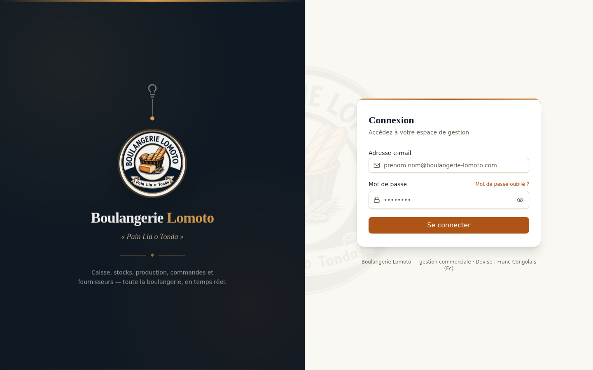 | 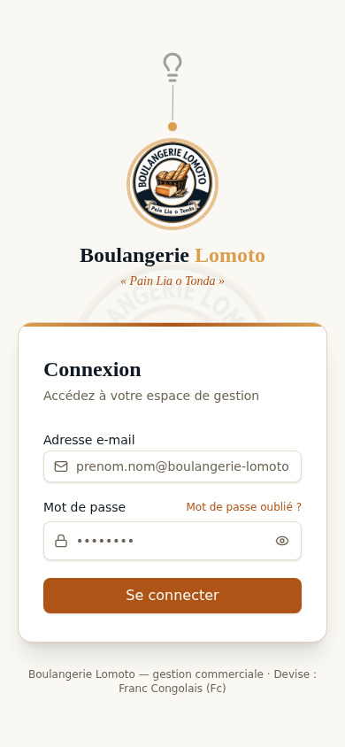 |
| Connexion — `prefers-reduced-motion` | Enveloppe authentifiée — bureau |
| 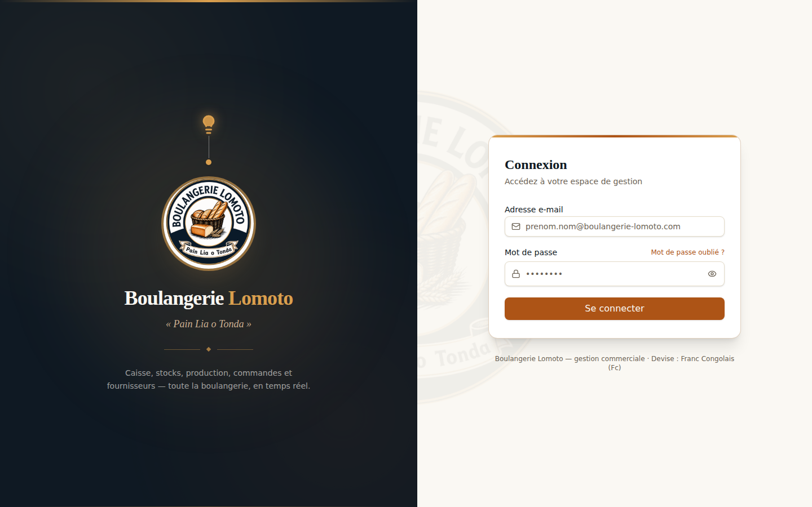 | 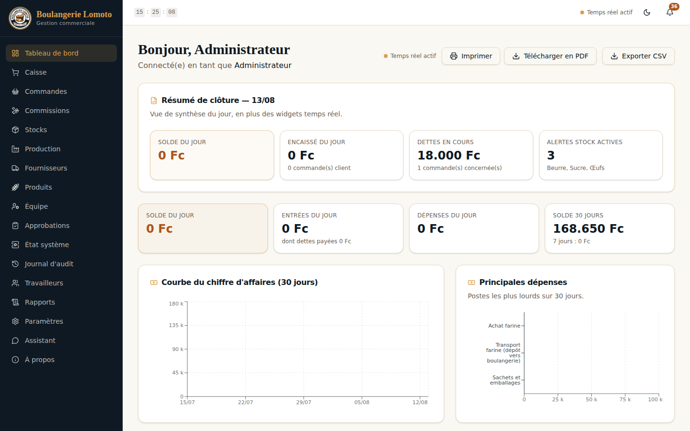 |
| Enveloppe authentifiée — mobile | Enveloppe authentifiée — mobile, tiroir ouvert |
| 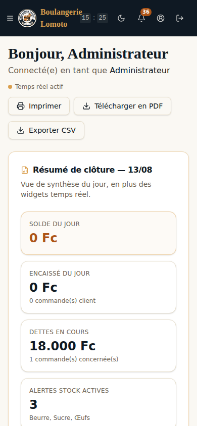 | 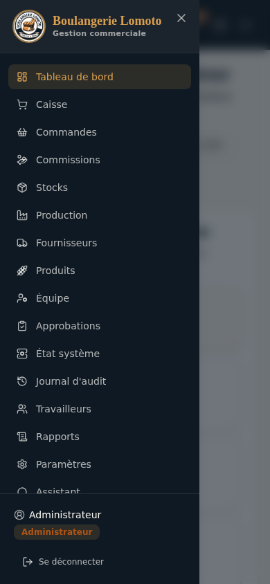 |

---

# F3 — Intégration Premium finale

> Base : `agent/integration-wave-1` au commit `12dc08526de9ae736842ce69ea05e0fb58622490`
> (F2 fusionnée, intègre C2 + C3 — services premium sécurisés).
> Branche : `claude/premium-integration-f3`.

Cette tâche commence après fusion de C3 (plan de coordination §8) : les pages
visuelles provisoires de F2 sont désormais connectées aux vrais endpoints
d'authentification, et deux parcours entièrement nouveaux sont intégrés — le
changement de mot de passe obligatoire et « Constellation Lomoto ».

## Endpoints connectés

| Endpoint (contrat C3) | Composant frontend |
|---|---|
| `POST /api/auth/mot-de-passe-oublie` | `pages/MotDePasseOublie.tsx` |
| `POST /api/auth/reinitialisation/verifier` | `pages/NouveauMotDePasse.tsx` (au chargement) |
| `POST /api/auth/reinitialisation` | `pages/NouveauMotDePasse.tsx` (soumission) |
| `POST /api/auth/mot-de-passe` | `pages/ChangementMotDePasseObligatoire.tsx` |
| `GET /api/auth/me` | `lib/auth.tsx` (`rafraichirIdentite`, nouveau) |
| `POST /api/auth/anniversaires/aujourdhui` | `components/ConstellationLomoto.tsx` |

Aucun nouvel endpoint créé, aucun contrat C3 modifié — uniquement des lectures
et intégrations frontend, conformément au périmètre autorisé (`apps/web/src/**`,
`docs/ui/**` ; `apps/api/**`/`prisma/**`/`packages/shared/**`/`docs/api-contracts/**`
lus seulement).

## A. Récupération du mot de passe

- **`pages/MotDePasseOublie.tsx`** — tous les messages provisoires « intégration
  serveur en attente » (F2) sont supprimés. Réponse `202` toujours identique
  affichée (anti-énumération PRÉSERVÉE : le corps de la réponse n'est jamais lu
  ni utilisé pour distinguer un compte existant d'un compte inexistant — un seul
  message générique, localisé, dans les 4 langues). `400` (format rejeté côté
  serveur), `429` (limitation de fréquence) et panne réseau affichent le message
  du serveur (déjà en français via `lib/api.ts`, convention existante de
  l'application). Double soumission empêchée par un garde synchrone (`enCours`).
- **`pages/NouveauMotDePasse.tsx`** — jeton lu UNIQUEMENT depuis l'URL
  (`?jeton=…`, format exact posé par `apps/api/src/services/email.ts`), jamais
  journalisé, jamais affiché dans un toast, jamais persisté dans `localStorage`
  (vérifié par test — voir plus bas). Vérifié via `POST
  .../reinitialisation/verifier` **au chargement**, avant d'autoriser le
  formulaire : jeton absent, mal formé, inconnu, expiré ou déjà utilisé
  aboutissent tous au même état « lien invalide », avec un lien direct vers
  `/mot-de-passe-oublie` pour permettre une nouvelle demande. Un jeton consommé
  entre la vérification et la soumission (code serveur
  `JETON_INVALIDE_OU_EXPIRE`) bascule sur ce même état. Après succès (`204`),
  le retour à la connexion est proposé par un bouton proéminent, jamais un
  simple lien perdu dans la page.

## B. Changement obligatoire du mot de passe

`utilisateur.motDePasseDoitChanger` (contrat C3) déclenche
`pages/ChangementMotDePasseObligatoire.tsx`, rendue par `App.tsx` **à la place
entière** de l'application authentifiée — pas de `<Layout>`, pas de
`<Routes>` métier montées, quel que soit le chemin déjà présent dans l'URL :
une navigation directe vers une URL métier pendant cet état retombe donc
systématiquement sur cet écran bloquant (testé). Socket.io ne se connecte pas
non plus tant que ce drapeau est actif — garde symétrique ajoutée dans
`lib/socket.tsx` (`if (!utilisateur || utilisateur.motDePasseDoitChanger)`),
cohérente avec le serveur qui refuse déjà toute route métier avec `403
MOT_DE_PASSE_A_CHANGER` pour ce compte. Le formulaire appelle uniquement
`POST /api/auth/mot-de-passe` (aucun nouvel endpoint). Après succès,
`rafraichirIdentite()` (nouvelle méthode de `lib/auth.tsx`, `GET
/api/auth/me`) recharge l'identité — l'application normale ne revient
**qu'après cette confirmation serveur**, jamais en anticipant localement le
succès. Un toast Premium confirme le changement (retour transitoire, l'écran
disparaît de toute façon) ; une déconnexion reste proposée en échappatoire.

## C. Constellation Lomoto

**`components/ConstellationLomoto.tsx`** + **`anniversairesLogique.ts`**
(logique pure de regroupement). Appelle `POST
/api/auth/anniversaires/aujourdhui` **une seule fois par authentification**
via `useQuery` (`staleTime: Infinity`) — pas de second indicateur dans
`localStorage`, la réponse serveur (`dejaAffiche`) fait seule foi. N'affiche
rien si `noms` est vide ou si `dejaAffiche` vaut `true` (les deux cas renvoient
une liste vide, donc un seul test). Plusieurs anniversaires sont déjà groupés
par le serveur en un seul appel ; `formaterListeNoms()` compose uniquement le
texte affiché (« Alain », « Alain et Zoé », « Alain, Zoé et Marie » — la
conjonction est fournie par l'appelant, traduite dans les 4 langues, jamais
codée en dur). Le DTO `AnniversairesDuJourDTO` ne contient ni âge ni date de
naissance : rien à filtrer, rien à déduire. Une erreur réseau ne bloque jamais
l'application (`retry: false`, échec silencieux — même convention que les
requêtes paresseuses de `Layout.tsx`).

Accessibilité : réutilise le `Dialog` Radix déjà utilisé ailleurs dans
l'application (`components/ui/dialog.tsx`) — focus piégé, `Échap` ferme,
`role="dialog"` natif. Le focus est rendu à un emplacement logique à la
fermeture (`<main id="contenu-principal">`, posé par `Layout.tsx`), pas laissé
retomber sur `<body>`. Animation décorative (étoiles scintillantes, entrée en
fondu — `.lomoto-constellation-*`, `index.css`, même convention que
`.lomoto-authshell-*` de F2) suspendue par `usePrefersReducedMotion()` (double
barrière CSS/JS, même modèle que F2).

## D. Toasts et notifications

Toast Premium (F1) réservé aux retours transitoires (changement de mot de
passe obligatoire réussi) ; les informations qui demandent lecture/action
restent des messages persistants (`role="status"`/`role="alert"` inline,
comme en F2) — jamais les deux pour le même contenu (aucune double annonce).
Le rollback concurrent des notifications (`lib/notificationsRollback.ts`,
validé en F1) est **intact** : la seule modification de `lib/socket.tsx` est
la garde d'entrée de connexion citée en §B, aucune des fonctions de rollback
elles-mêmes n'a été touchée — confirmé par les 65 tests existants de
`notificationsRollback.test.ts`, toujours tous passants.

## Garanties de confidentialité (jeton de réinitialisation)

- Jamais journalisé (`console.*`) ;
- jamais affiché dans un toast ni dans un message persistant ;
- jamais persisté dans `localStorage` (seul `lomoto_token`, le JWT de session,
  y est écrit par `lib/api.ts` — comportement préexistant, non lié au jeton de
  réinitialisation) ;
- vit uniquement dans l'état React dérivé de l'URL (`useSearchParams`),
  jamais recopié ailleurs.

## Tests ajoutés

| Fichier | Couvre |
|---|---|
| `pages/MotDePasseOublie.dom.test.tsx` (réécrit) | Appel réel de l'API, `202` (message persistant unique), anti-énumération (même message quel que soit le corps serveur), `400`, `429`, panne réseau, double soumission empêchée |
| `pages/NouveauMotDePasse.dom.test.tsx` (réécrit) | Jeton absent/valide/invalide, vérification au chargement, panne réseau pendant la vérification (conservateur), succès `204` + retour connexion proéminent, jeton invalidé entre vérification et soumission, erreur réseau à la soumission (formulaire préservé), double soumission empêchée, jeton jamais dans `localStorage` |
| `pages/ChangementMotDePasseObligatoire.dom.test.tsx` (nouveau) | Validation locale, appel API, mot de passe actuel incorrect (401), panne réseau, succès (toast + `rafraichirIdentite`), double soumission empêchée, déconnexion |
| `App.dom.test.tsx` (nouveau) | Blocage de toute URL métier tant que `motDePasseDoitChanger` est actif (aucun `<nav>` monté), sur plusieurs chemins, avec échappatoire de déconnexion |
| `components/anniversairesLogique.test.ts` (nouveau) | Regroupement pur des noms (0/1/2/3+ personnes), conjonction fournie par l'appelant, non-mutation du tableau d'entrée |
| `components/ConstellationLomoto.dom.test.tsx` (nouveau) | Aucun anniversaire, déjà affiché, un seul, plusieurs groupés (une seule célébration), absence d'âge/date de naissance, échec réseau non bloquant, appel unique par montage, clavier (`Échap` + retour de focus), `prefers-reduced-motion` |

Résultat : `npm test` → **343/343 tests passants** (41 fichiers, +42 tests F3).
`npm run build` (tsc + vite) et `npm audit` (0 vulnérabilité) passent
également. `npm ci` exécuté avec succès avant la vérification finale.

## Captures d'écran

Prises avec Playwright (Chromium) sur l'application réellement compilée —
réponses serveur simulées par interception réseau (`page.route`), jamais de
maquette statique. Le fichier `sessionStorage` `lomoto_splash_vu` est
pré-rempli pour ne pas capturer l'écran de démarrage (7 s).

| | |
|---|---|
| Récupération — bureau | Récupération — mobile |
| 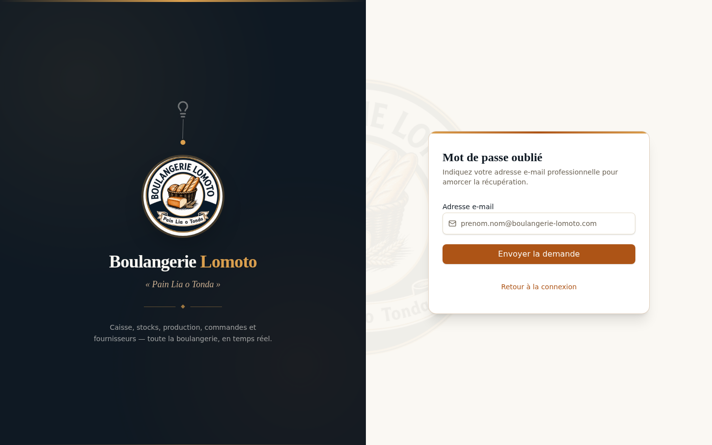 | 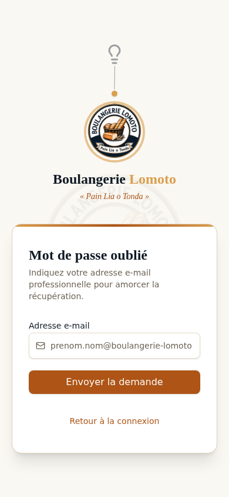 |
| Lien de réinitialisation expiré | Changement de mot de passe obligatoire |
| 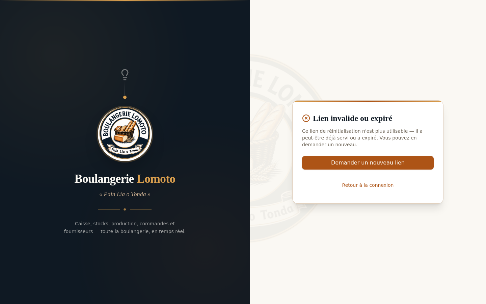 | 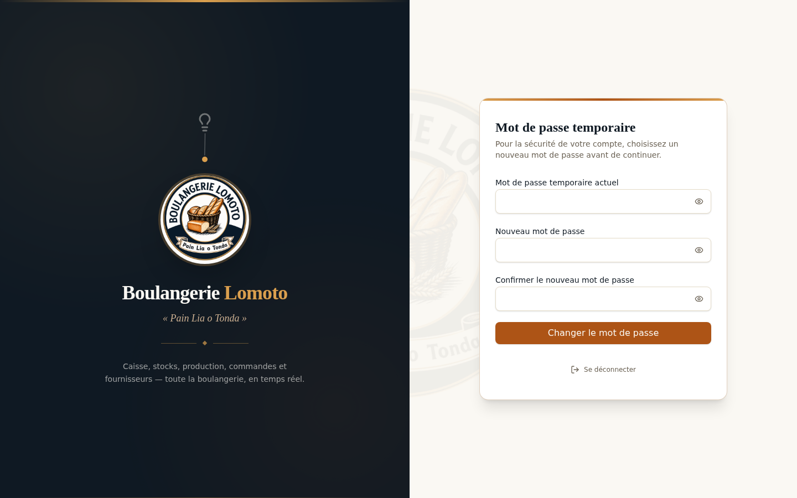 |
| Constellation Lomoto — plusieurs anniversaires | Constellation Lomoto — `prefers-reduced-motion` |
| 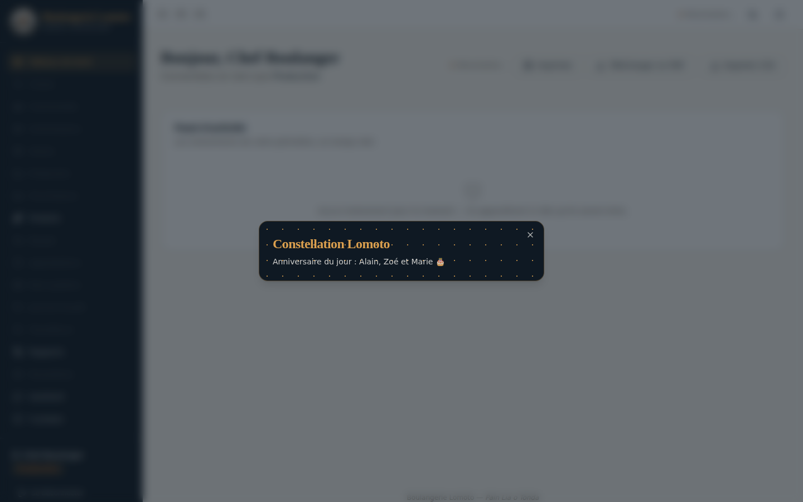 | 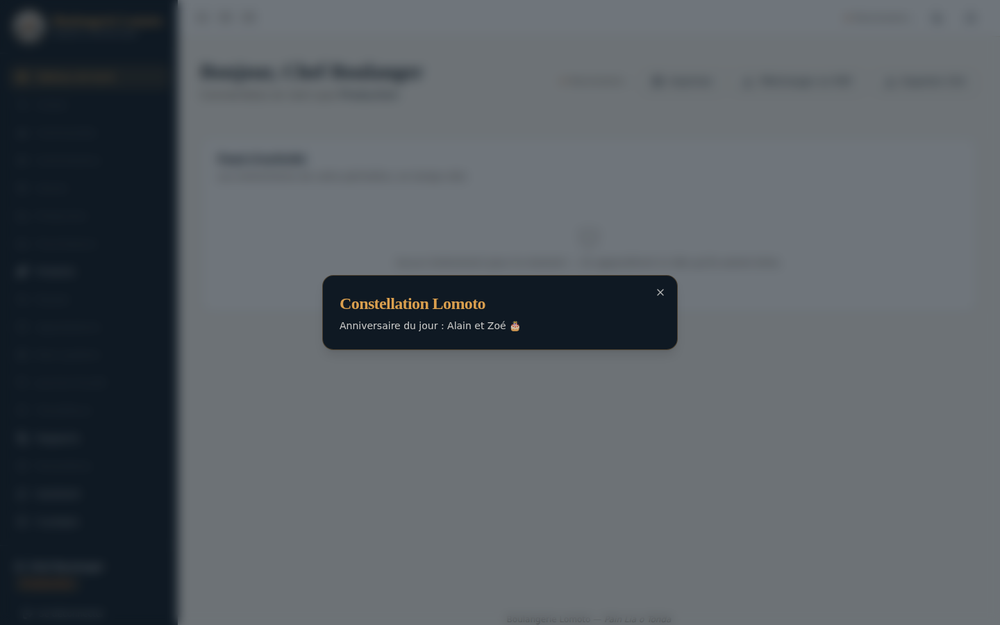 |
